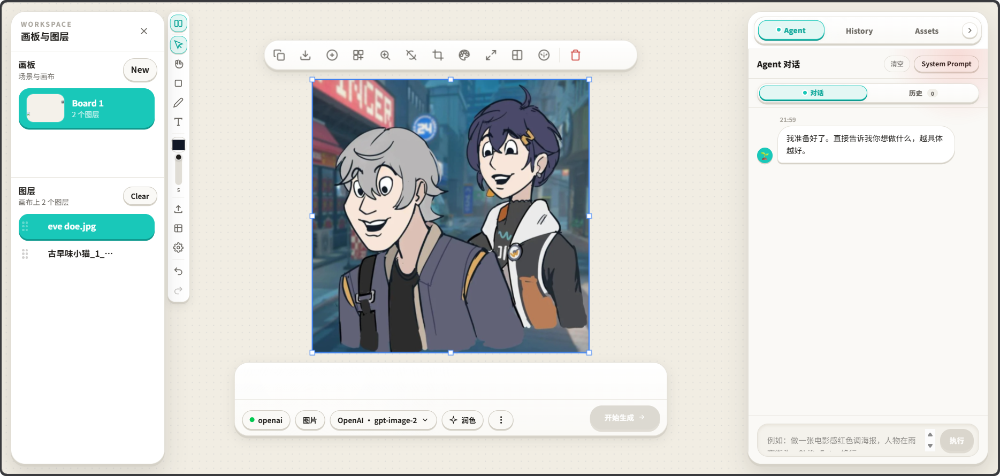
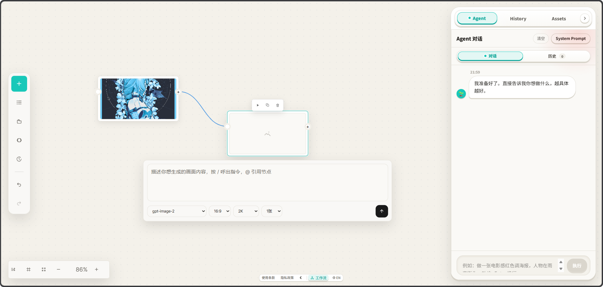

<p align="center">
  
</p>

<h1 align="center">Flovart</h1>

<p align="center">
  <strong>Open-source Lovart — bring your own key, plug in every model, turn the canvas into an Agent runtime</strong>
</p>

<p align="center">
  <a href="https://avabbbb.github.io/Flovart/" target="_blank"><strong>👉 Live Demo</strong></a>
</p>

<p align="center">
  <a href="https://avabbbb.github.io/Flovart/">Live Demo</a> •
  <a href="docs/overview/quick-start.en.md">Getting Started</a> •
  <a href="docs/overview/features.en.md">Features</a> •
  <a href="docs/progress/roadmap.en.md">Roadmap</a>
</p>

<p align="center">
  
  
  
  
</p>

<p align="center">
  
</p>

<p align="center">
  <a href="./README.en.md">English</a> •
  <a href="./README.md">简体中文</a>
</p>

---

## 📸 Dual Workspace Preview

<table>
  <tr>
    <td width="50%">
      
      <p align="center"><strong>Canvas Workspace</strong> - Infinite canvas + AI creation</p>
    </td>
    <td width="50%">
      
      <p align="center"><strong>Workflow Workspace</strong> - Node-based orchestration</p>
    </td>
  </tr>
</table>

---

## What is this?

I wanted a canvas truly built for AI creation —

- **Freer models**: BYOK (bring your own key), with 12+ providers natively integrated — Google / OpenAI / DeepSeek / MiniMax / Volcengine / Qwen and more — plus an OpenAI-compatible relay adapter so you can connect any endpoint yourself.
- **A more thorough workflow**: A dual-workspace architecture of Canvas + Workflow (node flow) with one-click switching. When the node view feels too heavy, collapse it and use it as a helper while you focus on canvas creation.
- **More driveable**: Three deterministic entry points — CLI (`tools/flovart/cli.js`), SKILL.md, and host config. Every media element on the canvas is exposed as a command. External agents handle planning; Flovart handles execution.
- **A nicer frontend**: Animal Crossing-style Tactile Shell visual language, infinite canvas, `@` layer references, double-click to focus / triple-click to fit, bilingual + light/dark adaptive themes.

Four deployment forms to choose from: live demo, Tauri desktop app, Chrome/Edge browser extension, and Docker self-hosting.

If you share the same wish, pull requests are welcome.

## Special Thanks

**[@labiaaaaaaaaa](https://github.com/labiaaaaaaaaa)** — Drove core fixes for third-party service adaptation, helping Flovart continuously improve integration rules for aggregation gateways and compatible endpoints.

---

## 🚀 Getting Started

```bash
git clone https://github.com/avabbbb/Flovart.git
cd Flovart
npm install
npm run dev
```

Open http://localhost:3217 and enter your service credentials in Settings.

> We recommend [Google AI Studio](https://aistudio.google.com/apikey) to get free Gemini credentials.

For more deployment options (Agent / CLI, Docker, browser extension, etc.), see [Getting Started](docs/overview/quick-start.en.md).

---

## 🎯 Features

Flovart is best used as a creative workflow rather than treating each capability in isolation:

| Workflow | How You'll Use It |
| -------- | ----------------- |
| **Import references** | Drag characters, scenes, products, or sketches into the canvas as visual anchors for later generation. |
| **@ Reference canvas nodes** | Type `@` in the PromptBar below a node to directly reference images, videos, or text nodes from the canvas as context. |
| **Generate 4 options** | Batch-generate 2/4 directions around the same set of references; quickly compare composition, style, and detail. |
| **A/B compare & local edits** | Use the compare view to pick results, then inpaint, outpaint, remove background, upscale, or apply filters to the selected image. |
| **Save as asset** | Keep satisfying characters, scenes, and props in the asset library; drag them back onto the canvas later to reuse. |
| **Let Agent extend** | External agents can read the canvas, ignite nodes, retry failed tasks, and continue extending shots or videos via CLI / SKILL. |

**Core Capabilities**: Infinite canvas, AI text-to-image/image-to-image/text-to-video, Multi-Agent collaboration, inpainting/outpainting, filters & color grading, layer masks, batch generation, prompt polishing, character lock, asset library, 12+ providers, bilingual & theme switching.

For the complete feature list, see [Features](docs/overview/features.en.md).

---

## 📋 Roadmap

### Done ✅

- [X] Infinite canvas + basic design tools
- [X] Multi-provider BYOK system (12+ providers)
- [X] AI text-to-image / image-to-image / text-to-video
- [X] Agent-Native CLI (30+ deterministic commands)
- [X] Canvas ↔ Workflow dual-workspace switching
- [X] Docker / Tauri desktop / Live demo
- [X] Full compatibility with third-party API aggregation endpoints
- [X] Tactile Shell AC visual language

### In Progress 🚧

- [ ] Chrome / Edge store listing
- [ ] Encrypted credential storage on the extension
- [ ] Node-flow visual editor iteration

### Planned 📝

- [ ] LangGraph.js agent orchestration
- [ ] One-click AI short-drama pipeline
- [ ] Real-time collaboration (CRDT)
- [ ] Plugin marketplace

For the full roadmap, see [Roadmap](docs/progress/roadmap.en.md).

---

## 🤝 Contributing

1. Fork this repository
2. Create a branch `git checkout -b feature/xxx`
3. Commit changes `git commit -m 'Add xxx'`
4. Push `git push origin feature/xxx`
5. Open a Pull Request

> [CONTRIBUTING.md](./CONTRIBUTING.md) · [CODE_OF_CONDUCT.md](./CODE_OF_CONDUCT.md)

---

## ⭐ Star History

If Flovart helps you, give it a Star ⭐ to show your support!

[](https://star-history.com/#avabbbb/Flovart&Date)

---

## 📄 License & Disclaimer

This project is open-sourced under the [GNU Affero General Public License v3.0 only](./LICENSE).

By using this product you agree to the [Terms of Service](./TERMS_OF_SERVICE.md) and [Privacy Policy](./PRIVACY_POLICY.md).

### Unofficial Deployment Notice

Flovart's official release channels are limited to:

- **GitHub repository**: [github.com/avabbbb/Flovart](https://github.com/avabbbb/Flovart)
- **Live demo**: [avabbbb.github.io/Flovart](https://avabbbb.github.io/Flovart)
- **Desktop builds**: EXE / DMG / deb / AppImage signed by this repo's Actions

Apart from the addresses above, any third-party public deployment, mirror site, hosting service, modified service, bundled package, or cloud-drive distribution is unofficial and unrelated to the author.

**Do not enter your API key or other sensitive information on unofficial sites.**

### AI-Generated Content

Flovart is a local-first AI creation tool that calls model services through third-party API keys you configure yourself. All images, videos, and text you generate with this tool are produced by API keys and models under your control. **You are responsible for the compliance, copyright ownership, and legality of the generated content.**

Flovart does not bundle any model service, does not store users' API keys, and makes no intellectual property claims over generated content.
