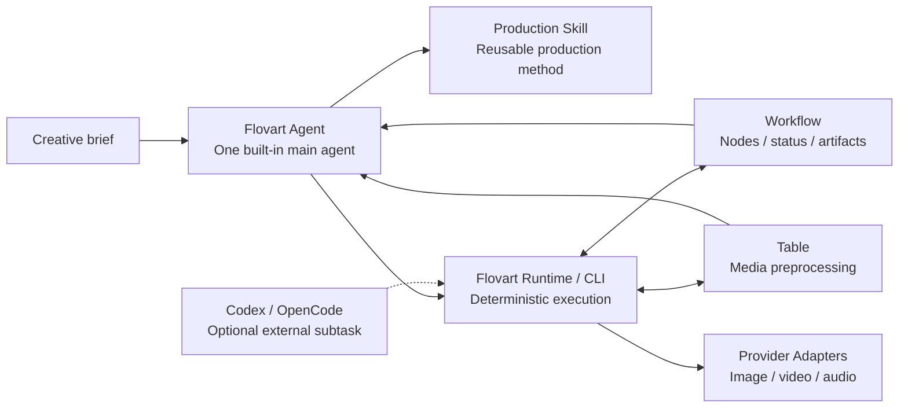

<p align="center">
  
</p>

<h1 align="center">Flovart</h1>

<p align="center">
  <strong>A local-first AI video production system with Workflow, Table, and Agent: orchestration, focused preprocessing, and spatial agent collaboration each have a clear home.</strong>
</p>

<p align="center">
  <a href="https://avabbbb.github.io/Flovart/"><strong>Live Demo</strong></a> ·
  <a href="docs/overview/quick-start.en.md">Getting Started</a> ·
  <a href="docs/content/docs/overview/features.en.mdx">Features</a> ·
  <a href="docs/content/docs/progress/todo.mdx">Roadmap</a> ·
  <a href="stats/README.md">Project Data</a> ·
  <a href=".github/CONTRIBUTING.md">Contributing</a> ·
  <a href="./README.md">简体中文</a>
</p>

<p align="center">
  
  
  
  
  <a href="https://github.com/avabbbb/Flovart/releases"></a>
  <a href="https://github.com/avabbbb/Flovart/stargazers"></a>
</p>

<p align="center">
  <a href="stats/README.md"></a>
  <br />
  <sub>README impressions (third-party counter, not unique visitors)</sub>
</p>

## Interface tour

<p align="center">
  
  <br />
  <sub>Workflow: organize assets, generation nodes, connections, and results in one production graph.</sub>
</p>

<table>
  <tr>
    <td width="50%" align="center">
      
      <br />
      <sub>Skill home: choose a production method before entering a project.</sub>
    </td>
    <td width="50%" align="center">
      
      <br />
      <sub>Low-friction guidance for invocation, cost boundaries, and safety.</sub>
    </td>
  </tr>
</table>

## What is Flovart?

Flovart is a local-first AI video production system centered on one built-in **Flovart Agent**. It has three official workspaces: **Workflow** owns multi-node generation orchestration; **Table** focuses on one media item or Workflow node at a time; **Agent** organizes the main conversation, optional external coding-agent subtasks, project context, and artifacts. They share providers, assets, and artifact semantics without restoring the removed Canvas or Art system.

The system separates video production into four stable responsibilities:

| Role | Responsibility |
| --- | --- |
| **Flovart Agent** | The one built-in production agent users collaborate with directly: it understands the brief, selects methods, supervises execution, and restores the main conversation. |
| **Production Skill** | A production method loaded by Flovart Agent that defines style, shot language, stages, checkpoints, and acceptance criteria. |
| **Flovart Runtime / CLI** | The deterministic execution layer: operates registered capabilities and persists tasks and artifacts without asking the agent to guess HTTP calls or manipulate the UI. |
| **Provider Adapter** | Exclusively owns model routing, credential injection, submission, and polling; Production Skills never access API keys. |

In one line: **Workflow orchestrates generation, Table focuses preprocessing, and Agent understands, executes, and supervises production in a spatial task interface.**


```mermaid
flowchart LR
  B["Creative brief"] --> A["Flovart Agent<br/>One built-in main agent"]
  A --> S["Production Skill<br/>Reusable production method"]
  A --> C["Flovart Runtime / CLI<br/>Deterministic execution"]
  X["Codex / OpenCode<br/>Optional external subtask"] -.-> C
  C <--> W["Workflow<br/>Nodes / status / artifacts"]
  C <--> T["Table<br/>Media preprocessing"]
  C --> M["Provider Adapters<br/>Image / video / audio"]
  W --> A
  T --> A
```

## Why this architecture?

- **Separated responsibilities**: Workflow owns multi-node generation orchestration; Table processes one input at a time; Agent spatially organizes Codex threads and task state, so generation, processing, and conversation are not forced back into one cluttered surface.
- **BYOK and multi-model**: users configure their own credentials while provider adapters connect image, video, and text models.
- **Recoverable production**: the CLI returns JSON status so an agent can poll, retry, and resume instead of relying on one long conversation.
- **Reusable style**: a Production Skill captures production knowledge so the same visual language and process can be applied across projects.
- **Composable roles**: writing, storyboarding, visual generation, voice, editing, and quality control can be owned by Production Skills and optional specialist subtasks while sharing one Workflow.

## Production Skill ecosystem

Flovart will define the minimum integration contract for Production Skills and provide Skill Creator guidance for community authors. The contract covers:

- identity, versioning, compatibility, and required Flovart capabilities;
- brief inputs, configurable parameters, and structured outputs;
- Workflow recipes, production stages, and role ownership;
- style bible, shot rules, sound rules, and forbidden patterns;
- checkpoints, recovery, human approval, and final acceptance;
- artifact lineage, model policy, cost controls, and safety boundaries.

[VOX Skill](https://github.com/avabbbb/vox-director) is the first stylized Production Skill reference; its upstream repository and technical invocation handle remain `vox-director`. The goal is to combine Flovart Agent, Production Skills, and the user's providers into a reusable end-to-end film workflow.

> The Production Skill contract, Skill Creator template, TUI `/commands`, and real-time event monitoring are still under development. The new Table and Agent surfaces are being implemented.

## Current capabilities and boundaries

| Module | Status |
| --- | --- |
| Workflow node orchestration, local projects, and assets | Foundation available |
| Table workspace entry point | Integrated; currently a placeholder |
| Table single-media / node preprocessing | In design and implementation |
| Agent spatial task workspace | In design and implementation |
| Multi-provider BYOK, text-to-image, image-to-image, and text-to-video | Foundation available |
| Workflow CLI, command schemas, and JSON status | Converging |
| Codex and OpenCode host adapters | Priority work |
| Production Skill contract and UGC ecosystem | In design and implementation |
| TUI `/xxxx` shortcuts, job subscriptions, and resumable runs | Planned |

The creator runtime is primarily TypeScript and Node.js. Go + Gin + GORM belong to the enterprise control plane for organizations, RBAC, audit, and private deployment management; Go is not the creative runtime.

## Quick start

### Start the frontend

```bash
git clone https://github.com/avabbbb/Flovart.git
cd Flovart
npm install
npm run dev
```

Open <http://localhost:11451> and configure your own model-service credentials in Settings.

### Inspect the Workflow CLI

```bash
npm run flovart:cli -- command.list --json
npm run flovart:cli -- command.schema --command workflow.node.run --json
npm run flovart:cli -- workflow.project.list --json
```

The CLI accepts explicit commands only. External agents should inspect `command.list` and `command.schema` before operating Workflow; they should not invent internal HTTP calls or scrape the UI.

More documentation:

- [Getting Started](docs/overview/quick-start.en.md)
- [Features](docs/content/docs/overview/features.en.mdx)
- [Roadmap](docs/content/docs/progress/todo.mdx)
- [AI documentation index](docs/index.md)

## Local-first and security

- Projects, assets, and generation history are currently stored primarily in the browser; cloud sync is not promised.
- API keys are currently stored locally in the browser, and the frontend calls configured model services directly.
- Never put API keys in a Production Skill, prompt, log, or repository. Agents and the CLI should only receive redacted readiness status.
- Do not enter API keys into unofficial deployments. Official channels are this repository, the [live demo](https://avabbbb.github.io/Flovart/), and desktop builds published by this repository's Actions.

## Contributing

Issues and pull requests for provider adapters, Workflow capabilities, host integrations, and Production Skills are welcome. Start from the [Issue chooser](https://github.com/avabbbb/Flovart/issues/new/choose) and read the [contribution conventions](.github/CONTRIBUTING.md): keep one problem per Issue, link every PR to an Issue, state non-goals, and attach verification evidence. UI changes require before-and-after screenshots.

Special thanks to [@labiaaaaaaaaa](https://github.com/labiaaaaaaaaa) for driving third-party service compatibility and aggregation-endpoint fixes.

## License and disclaimer

Flovart is licensed under the [GNU Affero General Public License v3.0 only](./LICENSE). By using the project, you agree to the [Terms of Service](./docs/TERMS_OF_SERVICE.md) and [Privacy Policy](./docs/PRIVACY_POLICY.md).

Flovart does not bundle model services and makes no intellectual-property claim over generated content. You are responsible for the copyright, compliance, and lawful use of your models, input assets, and generated output.
