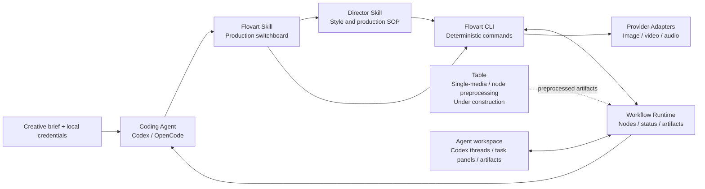

<p align="center">
  
</p>

<h1 align="center">Flovart</h1>

<p align="center">
  <strong>A local-first AI video production system with Workflow, Table, and Agent: orchestration, focused preprocessing, and spatial agent collaboration each have a clear home.</strong>
</p>

<p align="center">
  <a href="https://avabbbb.github.io/Flovart/"><strong>Live Demo</strong></a> ·
  <a href="docs/overview/quick-start.en.md">Getting Started</a> ·
  <a href="docs/content/docs/overview/features.en.mdx">Features</a> ·
  <a href="docs/content/docs/progress/todo.mdx">Roadmap</a> ·
  <a href="./README.md">简体中文</a>
</p>

<p align="center">
  
  
  
  
</p>

<p align="center">
  
</p>

## What is Flovart?

Flovart is a local-first AI video production system for coding agents with three official parts: **Workflow** owns multi-node generation orchestration; **Table** focuses on one media item or Workflow node at a time; **Agent** arranges Codex threads, task state, project context, and artifacts in a spatial workspace. They share providers, assets, and artifact semantics without restoring the removed Canvas or Art system.

The system separates video production into four stable responsibilities:

| Role | Responsibility |
| --- | --- |
| **Coding Agent** | Understands the brief, plans the work, organizes production roles, monitors progress, and recovers failures. Codex and OpenCode are the first target hosts. |
| **Flovart Skill** | The production switchboard: exposes capabilities, constrains call order, validates Director Skills, and tells the agent when to invoke the CLI. |
| **Director Skill** | A reusable directing method that defines style, shot language, production stages, checkpoints, and acceptance criteria. |
| **Flovart CLI** | The deterministic actuator: operates currently registered Workflow capabilities, invokes providers, and returns structured status without asking the agent to guess HTTP calls or manipulate the UI. |

In one line: **Workflow orchestrates generation, Table focuses preprocessing, and Agent understands, executes, and supervises production in a spatial task interface.**


```mermaid
flowchart LR
  B["Creative brief + local credentials"] --> A["Coding Agent<br/>Codex / OpenCode"]
  A --> P["Flovart Skill<br/>Production switchboard"]
  P --> D["Director Skill<br/>Style and production SOP"]
  P --> C["Flovart CLI<br/>Deterministic commands"]
  D --> C
  C <--> W["Workflow Runtime<br/>Nodes / status / artifacts"]
  T["Table<br/>Single-media / node preprocessing<br/>Under construction"] -. "preprocessed artifacts" .-> W
  G["Agent workspace<br/>Codex threads / task panels / artifacts"] <--> W
  C --> M["Provider Adapters<br/>Image / video / audio"]
  W --> A
```

## Why this architecture?

- **Separated responsibilities**: Workflow owns multi-node generation orchestration; Table processes one input at a time; Agent spatially organizes Codex threads and task state, so generation, processing, and conversation are not forced back into one cluttered surface.
- **BYOK and multi-model**: users configure their own credentials while provider adapters connect image, video, and text models.
- **Recoverable production**: the CLI returns JSON status so an agent can poll, retry, and resume instead of relying on one long conversation.
- **Reusable style**: a Director Skill captures directing knowledge so the same visual language and production process can be applied across projects.
- **Composable roles**: writing, storyboarding, visual generation, voice, editing, and quality control can be owned by separate agents or Skills while sharing one Workflow.

## Director Skill ecosystem

Flovart will define the minimum integration contract for Director Skills and provide Skill Creator guidance for community authors. The contract covers:

- identity, versioning, compatibility, and required Flovart capabilities;
- brief inputs, configurable parameters, and structured outputs;
- Workflow recipes, production stages, and role ownership;
- style bible, shot rules, sound rules, and forbidden patterns;
- checkpoints, recovery, human approval, and final acceptance;
- artifact lineage, model policy, cost controls, and safety boundaries.

[VOX Director](https://github.com/avabbbb/vox-director) is a reference for this kind of stylized Director Skill. The goal is to combine the Flovart production switchboard, a community Director Skill, and the user's providers so a coding agent can reuse an end-to-end stylized film workflow.

> The Director Skill contract, Skill Creator template, TUI `/commands`, and real-time event monitoring are still under development. The new Table and Agent surfaces are being implemented.

## Current capabilities and boundaries

| Module | Status |
| --- | --- |
| Workflow node orchestration, local projects, and assets | Foundation available |
| Table workspace entry point | Integrated; currently a placeholder |
| Table single-media / node preprocessing | In design and implementation |
| Agent spatial task workspace | In design and implementation |
| Multi-provider BYOK, text-to-image, image-to-image, and text-to-video | Foundation available |
| Workflow CLI, command schemas, and JSON status | Converging |
| Codex and OpenCode host adapters | Priority work |
| Director Skill contract and UGC ecosystem | In design and implementation |
| TUI `/xxxx` shortcuts, job subscriptions, and resumable runs | Planned |

The creator runtime is primarily TypeScript and Node.js. Go + Gin + GORM belong to the enterprise control plane for organizations, RBAC, audit, and private deployment management; Go is not the creative runtime.

## Quick start

### Start the frontend

```bash
git clone https://github.com/avabbbb/Flovart.git
cd Flovart
npm install
npm run dev
```

Open <http://localhost:11451> and configure your own model-service credentials in Settings.

### Inspect the Workflow CLI

```bash
npm run flovart:cli -- command.list --json
npm run flovart:cli -- command.schema --command workflow.node.run --json
npm run flovart:cli -- workflow.project.list --json
```

The CLI accepts explicit commands only. External agents should inspect `command.list` and `command.schema` before operating Workflow; they should not invent internal HTTP calls or scrape the UI.

More documentation:

- [Getting Started](docs/overview/quick-start.en.md)
- [Features](docs/content/docs/overview/features.en.mdx)
- [Roadmap](docs/content/docs/progress/todo.mdx)
- [AI documentation index](docs/index.md)

## Local-first and security

- Projects, assets, and generation history are currently stored primarily in the browser; cloud sync is not promised.
- API keys are currently stored locally in the browser, and the frontend calls configured model services directly.
- Never put API keys in a Director Skill, prompt, log, or repository. Agents and the CLI should only receive redacted readiness status.
- Do not enter API keys into unofficial deployments. Official channels are this repository, the [live demo](https://avabbbb.github.io/Flovart/), and desktop builds published by this repository's Actions.

## Contributing

Issues and pull requests for provider adapters, Workflow capabilities, host integrations, and Director Skills are welcome.

Special thanks to [@labiaaaaaaaaa](https://github.com/labiaaaaaaaaa) for driving third-party service compatibility and aggregation-endpoint fixes.

## License and disclaimer

Flovart is licensed under the [GNU Affero General Public License v3.0 only](./LICENSE). By using the project, you agree to the [Terms of Service](./docs/TERMS_OF_SERVICE.md) and [Privacy Policy](./docs/PRIVACY_POLICY.md).

Flovart does not bundle model services and makes no intellectual-property claim over generated content. You are responsible for the copyright, compliance, and lawful use of your models, input assets, and generated output.
