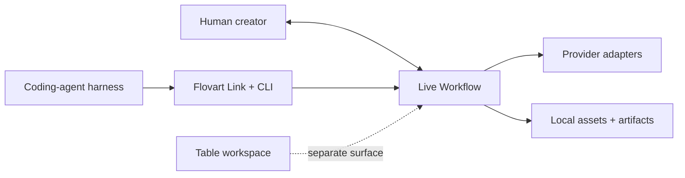

<p align="center">
  
</p>

<h1 align="center">Flovart</h1>

<p align="center">
  <strong>Your coding agent, now with a visual production studio.</strong>
</p>

<p align="center">
  Open-source, local-first and agent-native workspace for AI image and video production.<br />
  Let Codex, Claude Code and other local agents inspect, edit and run the same live Workflow you can see and change — with your own models, API keys, assets and reusable Production Skills.
</p>

<p align="center">
  English · <a href="./README.zh-CN.md">简体中文</a>
</p>

<p align="center">
  <a href="https://avabbbb.github.io/Flovart/"><strong>Try live demo</strong></a> ·
  <a href="https://github.com/avabbbb/Flovart/releases"><strong>Download preview</strong></a> ·
  <a href="docs/overview/quick-start.en.md">Get started</a> ·
  <a href="SUPPORT_MATRIX.md">Compatibility</a>
</p>

<p align="center">
  
  
  
  
  
  <a href="https://github.com/avabbbb/Flovart/releases"></a>
  <a href="https://github.com/avabbbb/Flovart"></a>
</p>

<p align="center">
  <a href="stats/README.md"></a>
  <br />
  <sub>README views · third-party counter, not unique visitors</sub>
</p>

## See the workspace

<p align="center">
  
  <br />
  <sub>A real Workflow view for organizing references, generation nodes, connections and results.</sub>
</p>

<table>
  <tr>
    <td width="50%" align="center">
      
      <br />
      <sub>Choose a production method before entering a project.</sub>
    </td>
    <td width="50%" align="center">
      
      <br />
      <sub>See invocation, cost boundaries and safety guidance before running it.</sub>
    </td>
  </tr>
</table>

The current screenshots are real Workflow and Skill surfaces. A future recording that shows an agent changing that same Workflow is specified in [README_VISUAL_TODO.md](docs/maintenance/readme/README_VISUAL_TODO.md); this README does not fabricate that evidence.

## Why Flovart?

Most AI creative tools make you choose between a visual editor and an autonomous agent. Flovart is built around one production state that both can use:

- **Agent-native:** a coding agent reaches the visible Workflow through typed Flovart Link and CLI operations, not mouse automation or a hidden project copy.
- **Human-editable:** nodes, connections, assets and results stay in the Workflow you can inspect and continue editing.
- **BYOK and multi-provider:** bring your own model services and API keys; real provider and billing behavior remains explicitly tracked as Experimental where it is not certified.
- **Production Skills:** package visual language, shot rules, workflow recipes, checkpoints and acceptance criteria into reusable production methods.

## One workspace, two ways to create

### With your agent

```text
Creative brief
      ↓
Codex / Claude Code / OpenCode
      ↓
Flovart Link + CLI
      ↓
Inspect · Apply · Run
      ↓
The visible Workflow
```

For example:

> “Open Flovart and build a three-shot product video Workflow from these references.”

The agent reads the current project and revision, applies explicit operations, and can run a confirmed node. The exact Host status is shown in the [Support Matrix](SUPPORT_MATRIX.md).

### By hand

You can still add, move, resize and connect nodes, drop local image or video files, configure a model, run generation, inspect artifacts and iterate visually. There is no separate “agent version” of your project: the human and agent paths converge on the same Workflow authority.

## What makes Flovart different?

| Capability | Flovart |
| --- | --- |
| Agent control | Typed operations against the actual visible Workflow |
| Human editing | The same graph, assets and results remain directly editable |
| Models | BYOK and multi-provider adapters, with capability-specific status |
| References | Graph connections, mentions, local assets and artifacts resolve into generation inputs |
| Production knowledge | Reusable Production Skills, not only reusable prompt text |
| Automation | Explicit inspect/apply/run operations with revision and approval boundaries |
| Data | Local-first storage with documented browser and runtime boundaries |

## What you can make

- **Agent-native Workflow:** compose image, text, video, audio and configuration nodes into visual generation flows.
- **Image and video generation:** choose modes, references and parameters, then monitor results and recovery through the Workflow.
- **Reference-aware production:** combine graph references, mentions, assets and generated artifacts as typed inputs instead of pasting everything into one prompt.
- **Production Skills:** reuse a method for a visual language, shot structure or production checklist across projects.
- **Local projects and assets:** keep projects, references and generation history close to the workspace, with no cloud-sync promise.
- **Extensible contracts:** providers, hosts, node operations and Skills meet explicit contracts so integrations can be tested without pretending a mock is a certified host.

The product surfaces behind this story are **Workflow** for generation orchestration, **Table** for the still-evolving media-preprocessing workbench, and **Agent** for the spatial production-control surface. Table and Agent are real application entries, but their remaining implementation and migration work is not presented as complete; see [Features](docs/content/docs/overview/features.en.mdx).

## Production Skills

Prompts are reusable text.

Production Skills are reusable production methods. A Skill can capture:

- visual language and style rules;
- shot structure and workflow recipes;
- checkpoints and human approvals;
- model policy, cost boundaries and safety rules;
- acceptance criteria for the final artifact.

The repository contains a local Flovart Skill surface and the [VOX Skill reference](https://github.com/avabbbb/vox-director). The broader community contract and ecosystem are still in design and implementation, so the Skill section is an active capability rather than a promise of a mature marketplace. Start with the [Skill guide](docs/overview/skill-guide.md).

## Bring your own models

```text
Your provider
      ↓
Your API key
      ↓
Your assets + Workflow
      ↓
Your generated result
```

Flovart does not bundle model services. Configure a provider in the app, choose the capabilities and model you need, and keep the provider terms, cost and output rights in your own hands. OpenAI-compatible BYOK and remote-provider paths are currently Experimental; adapter presence is not paid-provider certification. Use the [Support Matrix](SUPPORT_MATRIX.md) as the status source of truth.

## Compatibility

| Host or package | Status |
| --- | --- |
| Codex CLI + Browser Workflow | Experimental |
| Claude Code CLI projection | Experimental |
| OpenCode CLI projection | Experimental |
| DeepSeek Harness RC8 bundle/profile | Experimental |
| WorkBuddy CLI Connector + Skill | Experimental |
| CodeBuddy Code | Planned |
| Pi | Planned |
| Photoshop UXP panel | Experimental |
| Premiere Pro UXP panel | Experimental |
| After Effects | Experimental |
| DaVinci Resolve Studio | Experimental |

`Experimental`, `Planned` and External Gate items are not Stable claims. Evidence, boundaries and release gates live in the [Support Matrix](SUPPORT_MATRIX.md); this table is intentionally not a second compatibility policy.

## Quick start

### For creators

1. Download a preview build from [GitHub Releases](https://github.com/avabbbb/Flovart/releases).
2. Open Flovart and add an AI service in Settings.
3. Create or open a Workflow, add references, and start creating.

The public Releases page may contain test or preview artifacts; it is not a claim that every Host or Provider is Stable.

### For coding-agent users

Use the repository-verified source path while the versioned CLI package publication remains a release gate:

```bash
git clone https://github.com/avabbbb/Flovart.git
cd Flovart
npm install
npm run flovart:cli -- start --source --web --open
npm run flovart:cli -- workflow.inspect --json
```

Then ask your local agent: **“Open Flovart.”** The normal agent loop is `status`, `workflow.inspect`, `workflow.selection.get`, `workflow.apply` and `workflow.node.run`; the [Getting Started guide](docs/overview/quick-start.en.md) covers development-only diagnostics and isolated browser checks.

## Architecture



The implementation uses three names that are useful once the product story is clear:

- **External Coding Agent Harness:** the director that owns the main conversation and long-range plan.
- **Workspace Operator:** the only built-in execution agent; it uses typed tools inside a bounded intent.
- **Production Crew:** a group name for the Operator and deterministic dispatch/runtime/provider services, not a third agent.

The full protocol, state boundaries and migration notes are in the [ecosystem architecture package](docs/design/ecosystem/TARGET_ARCHITECTURE.md) and [current architecture record](docs/design/ecosystem/CURRENT_ARCHITECTURE.md).

## Local-first and security

- Projects, assets and generation history are stored primarily in the browser today; cloud sync is not promised.
- The current Web path stores API keys locally through the encrypted `localforage` vault, while the frontend calls the configured model service directly. Treat the browser as part of the secret boundary.
- Web, Desktop WebView and extension storage are normally isolated. Cross-entry synchronization through a restricted runtime bridge is still pending.
- Never put API keys in a Skill, prompt, log or repository. Agent and CLI paths should receive redacted readiness/capability state, not raw credentials.
- Use only the repository, the [live demo](https://avabbbb.github.io/Flovart/) and desktop artifacts published by the repository's Actions as official project channels. Review each provider's terms and the rights for your inputs and outputs.

## Roadmap

The next product-facing directions are:

- mature Agent Host authentication, recovery and visible Workflow certification;
- expand the Table media-processing workbench and the Production Skill ecosystem;
- certify creative-host packages and their real artifact import paths.

These are directions, not current Stable support. Follow [the roadmap](docs/content/docs/progress/todo.mdx) and [pending verification](docs/content/docs/progress/pending-test.mdx) for the evidence trail.

## Contributing

Contributions are especially useful in four areas: provider adapters, Production Skills, Host integrations and Workflow capabilities. Open an [Issue](https://github.com/avabbbb/Flovart/issues/new/choose), read the [contribution conventions](.github/CONTRIBUTING.md), and include verification evidence with UI changes.

## Acknowledgements

Thanks to [@labiaaaaaaaaa](https://github.com/labiaaaaaaaaa) for driving third-party service compatibility and aggregation-endpoint fixes.

## License and disclaimer

Flovart is licensed under the [GNU Affero General Public License v3.0 only](./LICENSE). By using the project, you agree to the [Terms of Service](./docs/TERMS_OF_SERVICE.md) and [Privacy Policy](./docs/PRIVACY_POLICY.md).

Flovart does not bundle model services and makes no intellectual-property claim over generated content. You are responsible for the copyright, compliance and lawful use of your models, input assets and generated output. See [project data and statistics](stats/README.md).
