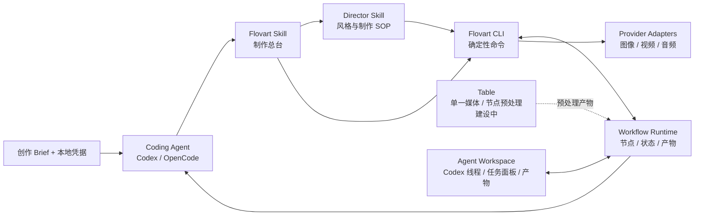

<p align="center">
  
</p>

<h1 align="center">Flovart</h1>

<p align="center">
  <strong>Workflow + Table + Agent 的本地优先 AI 视频制作系统：编排生成、专注预处理与空间化 Agent 协作各归其位。</strong>
</p>

<p align="center">
  <a href="https://avabbbb.github.io/Flovart/"><strong>在线体验</strong></a> ·
  <a href="docs/overview/quick-start.md">快速开始</a> ·
  <a href="docs/content/docs/overview/features.mdx">功能特性</a> ·
  <a href="docs/content/docs/progress/todo.mdx">开发计划</a> ·
  <a href="stats/README.md">项目数据</a> ·
  <a href=".github/CONTRIBUTING.md">参与贡献</a> ·
  <a href="./README.en.md">English</a>
</p>

<p align="center">
  
  
  
  
  <a href="https://github.com/avabbbb/Flovart/releases"></a>
  <a href="https://github.com/avabbbb/Flovart/stargazers"></a>
</p>

<p align="center">
  <a href="stats/README.md"></a>
  <br />
  <sub>README 展示次数（第三方计数，非独立访客）</sub>
</p>

## 界面一览

<p align="center">
  
  <br />
  <sub>Workflow：在同一制作图中组织素材、生成节点、连接与结果。</sub>
</p>

<table>
  <tr>
    <td width="50%" align="center">
      
      <br />
      <sub>Skill 首页：先选导演方法，再进入项目。</sub>
    </td>
    <td width="50%" align="center">
      
      <br />
      <sub>低门槛引导：说明调用词、费用边界与安全信息。</sub>
    </td>
  </tr>
</table>

## Flovart 是什么？

Flovart 是面向 Coding Agent 的本地优先 AI 视频制作系统，包含三个正式部分：**Workflow** 负责多节点生成编排，**Table** 一次专注处理一个媒体或 Workflow 节点，**Agent** 把 Codex 线程、任务状态、项目上下文和产物面板组织在空间工作区中。三者共享 Provider、素材和产物语义，但不恢复已经删除的旧 Canvas / Art 系统。

它把视频制作拆成四种稳定职责：

| 角色 | 职责 |
| --- | --- |
| **Coding Agent** | 理解 Brief、拆解任务、组织制作角色、监控进度并处理失败；优先适配 Codex 与 OpenCode。 |
| **Flovart Skill** | 制作总台：暴露能力、约束调用顺序、校验导演 Skill，并告诉 Agent 何时调用 CLI。 |
| **Director Skill** | 可复用导演方法：定义风格、镜头语言、制作步骤、检查点和验收标准。 |
| **Flovart CLI** | 确定性执行器：按注册表操作当前已开放的 Workflow 能力、调用 Provider、返回结构化状态，不让 Agent 猜 HTTP 或操纵 UI。 |

一句话：**Workflow 编排生成，Table 专注预处理，Agent 在空间任务界面里理解、执行和监督制作。**



## 为什么采用这套架构？

- **职责分离**：Workflow 负责多节点生成编排；Table 一次只处理一个输入；Agent 使用空间面板组织 Codex 线程和任务状态，避免把生成、处理和对话重新堆进同一张杂乱界面。
- **BYOK 与多模型**：凭据由用户配置，Flovart 通过 Provider 适配层调用图像、视频和文本模型。
- **可恢复**：CLI 返回 JSON 状态，Agent 可以轮询、重试、续跑，而不是依赖一次长对话完成整部短片。
- **风格可复用**：导演经验写进 Director Skill，同一种视觉语言和制作流程可以被不同项目重复调用。
- **能力可组合**：编剧、分镜、视觉生成、配音、剪辑和质检可以由不同 Agent/Skill 承担，共享同一个 Workflow。

## Director Skill 生态

Flovart 将规定导演 Skill 的最小对接契约，并通过 Skill Creator 模板指导社区创作。规范会覆盖：

- 身份、版本、兼容性和所需 Flovart 能力；
- 输入 Brief、可配置参数和结构化输出；
- Workflow 配方、制作阶段和角色分工；
- 风格圣经、镜头规则、声音规则和禁止项；
- 检查点、失败恢复、人工确认和最终验收；
- 产物血缘、模型策略、成本与安全边界。

[VOX Director](https://github.com/avabbbb/vox-director) 是这类风格化导演 Skill 的参考案例。目标是让用户组合“Flovart 制作总台 + 社区导演 Skill + 自己的 Provider”，由 Coding Agent 复用完整的风格化短片工作流。

第一次使用可直接阅读 [Skill 使用手册](docs/overview/skill-guide.md)，无需先学习 CLI 或 ProductionSpec。

> 基础 CLI/TUI、Flovart Skill 和 Codex/OpenCode 等 Host 配置已接入；Director Skill 社区契约、实时事件订阅和断点续跑仍在建设中。

## 当前能力与边界

| 模块 | 状态 |
| --- | --- |
| Workflow 节点编排、本地项目与素材 | 已有基础 |
| Table 单一媒体 / 节点预处理 | 基础界面与 Workflow 往返已接入；处理能力持续扩展 |
| Agent 空间任务工作区 | 主体界面已接入；持久任务与事件订阅待完善 |
| 多 Provider BYOK、文生图、图生图、文生视频 | 已有基础 |
| Workflow CLI、命令 Schema、JSON 状态 | 基础能力已接入 |
| Codex / OpenCode 等 Host 适配 | 基础 MCP/Skill 配置已接入 |
| Director Skill 契约与 UGC 生态 | 设计与实现中 |
| TUI 快捷命令 | 基础能力已接入；任务订阅与断点续跑待完善 |

当前创作者运行时以 TypeScript / Node.js 为主。Go + Gin + GORM 只用于企业控制面，例如组织、RBAC、审计和私有化管理；它不是视频制作运行时。

## 快速开始

### Windows 桌面版（小白用户）

从 [GitHub Releases](https://github.com/avabbbb/Flovart/releases) 下载 Actions 生成的 Windows NSIS `.exe` 安装包。首次启动会在本机创建业务数据；API Key 、Workflow、素材和生成历史不默认上传。

源码仓库在 Windows 上执行 `npm run tauri:build` 可生成无需发布私钥的本地 NSIS 安装器；`npm run tauri:build:release` 专供配置了 `TAURI_SIGNING_PRIVATE_KEY` 的正式更新包发布。

### Coding Agent / CLI

Node.js 20+ 用户可直接安装并启动版本化 Agent Toolkit：

```bash
npx flovart-cli install
npx flovart-cli start
npx flovart-cli init --host codex
```

`install` 会下载并校验与 CLI 同版本的 Runtime + Agent 包；`start` 启动本地桌面 Runtime 和托管 Agent。将 `codex` 换成 `opencode` / `claude` / `cursor` / `windsurf` / `vscode` 可生成对应 Host 配置。

### 源码与 SaaS 部署

```bash
git clone https://github.com/avabbbb/Flovart.git
cd Flovart
npm install
npx flovart-cli start --source --all --open
```

也可用 `docker compose up --build` 启动 Web / Hub / Enterprise / PostgreSQL 容器。Docker 静态资源生产路径仍在验证，当前更适合本地联调与私有部署预演。

### 检查 Workflow CLI

```bash
npm run flovart:cli -- command.list --json
npm run flovart:cli -- command.schema --command workflow.node.run --json
npm run flovart:cli -- workflow.project.list --json
```

CLI 只接受显式命令。外部 Agent 应先读取 `command.list` / `command.schema`，再执行 Workflow 操作，不应自行拼接内部 HTTP 请求或抓取界面。

更多入口：

- [快速开始](docs/overview/quick-start.md)
- [功能特性](docs/content/docs/overview/features.mdx)
- [开发计划](docs/content/docs/progress/todo.mdx)
- [AI 文档索引](docs/index.md)

## 本地优先与安全

- 当前项目、素材和生成记录主要保存在浏览器本地，不承诺云同步。
- API Key 加密保存在本地 `localforage` Vault；Workflow、素材、生成历史等业务数据分 store 写入 IndexedDB，大媒体不写入 `localStorage`。
- Web 站点、桌面 WebView 和浏览器扩展的 IndexedDB 默认彼此隔离；跨入口自动共享需要 Desktop Runtime 受限桥接，当前仍是待办，不宣称已实现。
- 不要把 API Key 写进 Director Skill、Prompt、日志或仓库；Agent 和 CLI 只应读取脱敏后的就绪状态。
- 请勿在非官方部署中输入 API Key。官方渠道仅包括本仓库、[在线 Demo](https://avabbbb.github.io/Flovart/) 和本仓库 Actions 发布的桌面构建。

## 参与贡献

欢迎通过 [Issue](https://github.com/avabbbb/Flovart/issues/new/choose) 和 Pull Request 贡献 Provider 适配、Workflow 能力、Host 集成和 Director Skill。提交前请阅读 [贡献约定](.github/CONTRIBUTING.md)，每个 Issue 聚焦一个问题，每个 PR 关联 Issue、写清非目标并附验证证据；UI 变更需要前后截图。

特别感谢 [@labiaaaaaaaaa](https://github.com/labiaaaaaaaaa) 推进第三方服务适配与兼容端点修复。

## 协议与声明

Flovart 基于 [GNU Affero General Public License v3.0 only](./LICENSE) 开源。使用本产品即表示同意 [使用条款](./docs/TERMS_OF_SERVICE.md) 和 [隐私政策](./docs/PRIVACY_POLICY.md)。

Flovart 不内置模型服务，也不对生成内容主张知识产权。你需要自行确认所选模型、输入素材和生成内容的版权、合规性与使用合法性。
