<p align="center">
  
</p>

<h1 align="center">Flovart</h1>

<p align="center">
  <strong>Your coding agent, now with a visual production studio.</strong>
</p>

<p align="center">
  Open-source, local-first workspace where you and your coding agent edit the same live Workflow —<br />
  with your own image and video models, assets and API keys.
</p>

<p align="center">
  English · <a href="./README.zh-CN.md">简体中文</a>
</p>

<p align="center">
  <a href="https://avabbbb.github.io/Flovart/"><strong>Try live demo</strong></a> ·
  <a href="https://github.com/avabbbb/Flovart/releases"><strong>Download preview</strong></a> ·
  <a href="docs/overview/quick-start.en.md">Get started</a> ·
  <a href="SUPPORT_MATRIX.md">Compatibility</a>
</p>

<p align="center">
  
  
  
  
  
  <a href="https://github.com/avabbbb/Flovart/releases"></a>
  <a href="https://github.com/avabbbb/Flovart"></a>
</p>

<p align="center">
  <a href="stats/README.md"></a>
  <br />
  <sub>README views · third-party counter, not unique visitors</sub>
</p>

## See Flovart in action

<p align="center">
  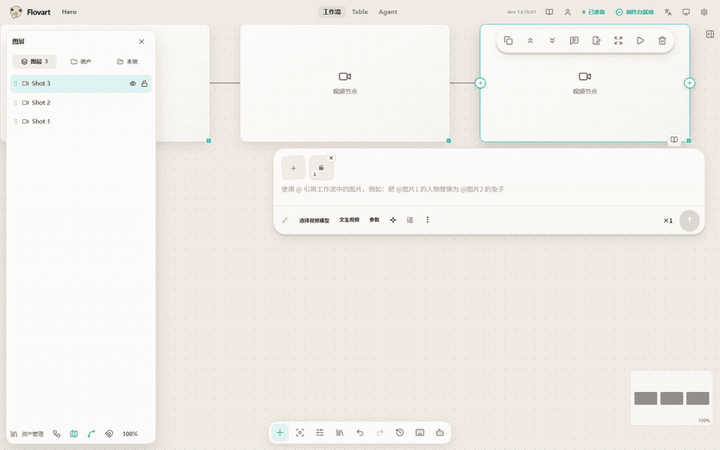
  <br />
  <sub><strong>An external coding agent editing the same live Flovart Workflow — natural language becomes nodes and edges.</strong><br />
  The agent (WorkBuddy codebuddy) drove the visible Workflow through the typed CLI
  surface: three nodes and two connections created live, with no source edits. No generation step was run, so no paid
  model service was called. Reproduction record: <a href="docs/maintenance/readme/DEMO_RECORDING.md">DEMO_RECORDING.md</a>.</sub>
</p>

Both halves are now on record: the hero above is an external coding agent session editing the live Workflow, and the CLI-only capture sits under [Architecture](#architecture) as the operation-level view. Remaining visual gaps are tracked in [README_VISUAL_TODO.md](docs/maintenance/readme/README_VISUAL_TODO.md).

## Quick start

### For creators

1. Download a preview build from [GitHub Releases](https://github.com/avabbbb/Flovart/releases).
2. Open Flovart and add an AI service in Settings.
3. Create or open a Workflow, add references, and start creating.

The Releases page may contain test or preview artifacts; it is not a claim that every host or provider is Stable.

### For coding-agent users

Run from a source checkout while the versioned CLI package remains a release gate:

```bash
git clone https://github.com/avabbbb/Flovart.git
cd Flovart
npm install
npm run flovart:cli -- start --source --web --open
npm run flovart:cli -- status --json
```

Then ask your local agent: **“Open Flovart and work on this Workflow.”**

Your agent learns Flovart through the **Agent Integration Skill** at `.agents/skills/flovart/` (mirrored for Claude under `.claude/skills/flovart/` and bundled for WorkBuddy under `integrations/workbuddy/flovart/skills/flovart/`). On a source checkout the harness auto-discovers it; the packaged CLI also ships it so `flovart ensure` can register it. This is a thin adapter — it teaches the agent the 5 operations below; it is not a Production Skill / Marketplace feature.

The normal agent loop is `status`, `workflow.inspect`, `workflow.selection.get`, `workflow.apply` and `workflow.node.run`. Connection setup and diagnostics use `ensure` and `doctor`; development-only browser checks are covered in the [Getting Started guide](docs/overview/quick-start.en.md).

## Feature tour

Every clip below is a real recording of the running app — one operation, start to finish, with no composited frames and no mockups. Each is cut to the action. Video and audio tools run ffmpeg.wasm in the browser; their core is pre-warmed before the recorded action, so the clip shows the operation rather than the one-off ~30MB wasm download — **clip length is therefore not the wait time on a first run**. Registration, method and limits: [DEMO_RECORDING.md](docs/maintenance/readme/DEMO_RECORDING.md).

### Canvas

<table>
  <tr>
    <td align="center">
      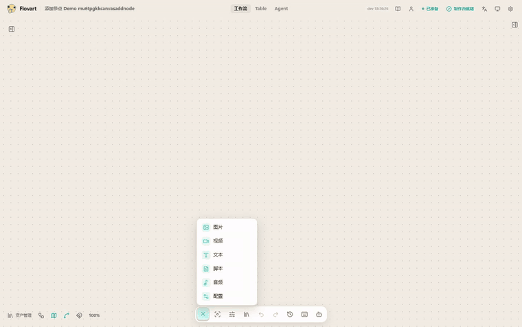
      <br /><sub><strong>Add nodes.</strong> The toolbar's add menu covers image, video, text, script, audio and config.</sub>
    </td>
    <td align="center">
      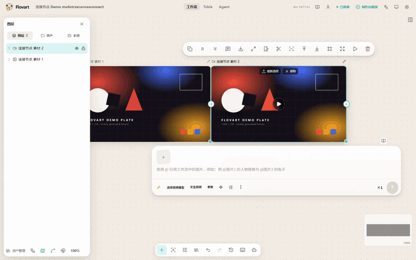
      <br /><sub><strong>Connect.</strong> Drag from a node's source handle onto another node to feed it in.</sub>
    </td>
  </tr>
  <tr>
    <td align="center">
      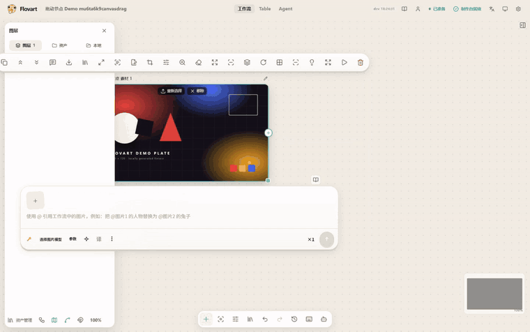
      <br /><sub><strong>Arrange by hand.</strong> Nodes move freely; the graph itself is the state.</sub>
    </td>
    <td align="center">
      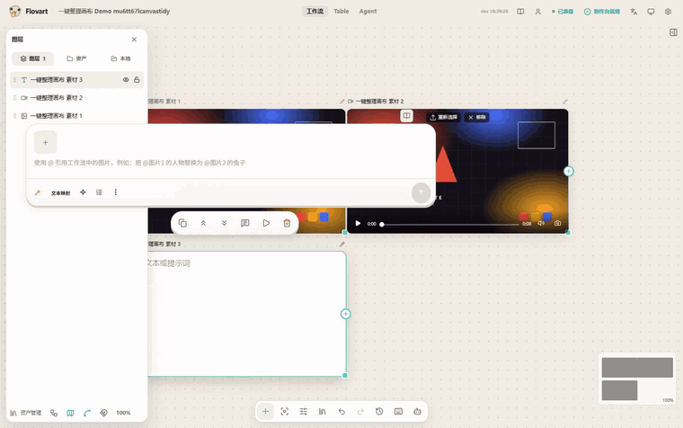
      <br /><sub><strong>Tidy.</strong> One click re-lays out the whole graph.</sub>
    </td>
  </tr>
  <tr>
    <td colspan="2" align="center">
      
      <br /><sub><strong>Prompt in place.</strong> Select a node and write the prompt on the node itself — no separate prompt dialog.</sub>
    </td>
  </tr>
</table>

### Image nodes

Four local operations on the same generated fixture plate, each producing a real result node. None of them contacts a model service.

<table>
  <tr>
    <td align="center">
      
      <br /><sub><strong>Crop.</strong> Set the crop rectangle, then apply.</sub>
    </td>
    <td align="center">
      
      <br /><sub><strong>Rotate and flip.</strong> Quarter turns and mirrors.</sub>
    </td>
  </tr>
  <tr>
    <td align="center">
      
      <br /><sub><strong>Split to grid.</strong> Each cell becomes its own connected image node.</sub>
    </td>
    <td align="center">
      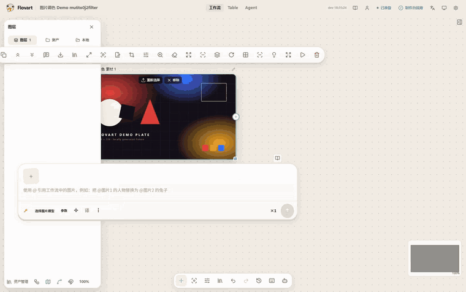
      <br /><sub><strong>Grade.</strong> Colour adjustments preview live before they are applied.</sub>
    </td>
  </tr>
</table>

### Video nodes

Also local, also without a model service: these run through the in-browser ffmpeg core, and each one creates its own result node (audio/video split creates two).

<table>
  <tr>
    <td align="center">
      
      <br /><sub><strong>Trim.</strong> Set the in/out points; the cut uses stream copy, so nothing is re-encoded.</sub>
    </td>
    <td align="center">
      
      <br /><sub><strong>Split audio and video.</strong> One video becomes a silent video node plus an audio node.</sub>
    </td>
  </tr>
  <tr>
    <td align="center">
      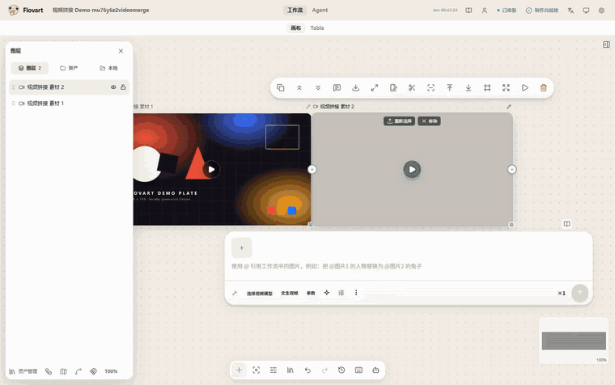
      <br /><sub><strong>Merge.</strong> Select several video nodes and join them in order.</sub>
    </td>
    <td align="center">
      
      <br /><sub><strong>Extract a frame.</strong> Pick a timecode and get an image node out of the video.</sub>
    </td>
  </tr>
  <tr>
    <td align="center">
      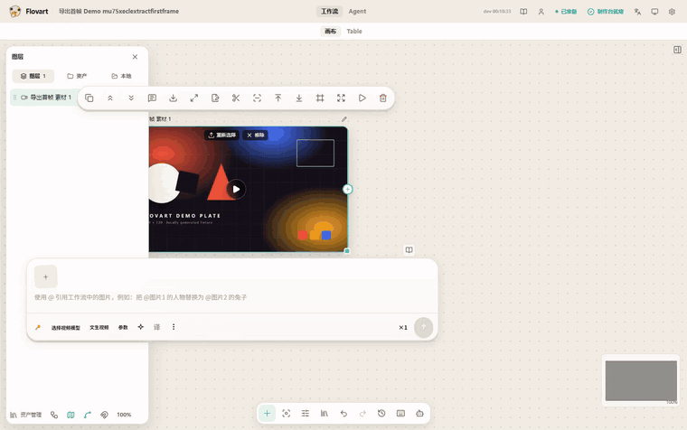
      <br /><sub><strong>First frame.</strong> One click, straight to an image node.</sub>
    </td>
    <td align="center">
      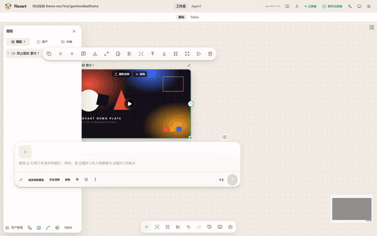
      <br /><sub><strong>Last frame.</strong> Same, from the tail of the clip.</sub>
    </td>
  </tr>
</table>

### Audio nodes

<table>
  <tr>
    <td align="center">
      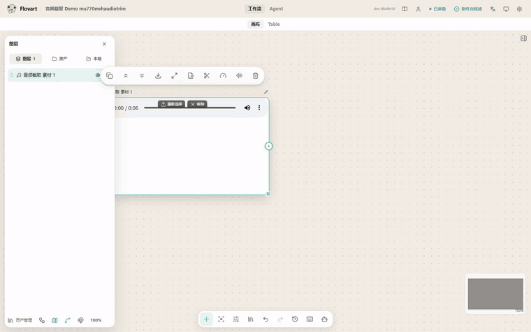
      <br /><sub><strong>Trim.</strong> Same in/out controls, same stream-copy cut.</sub>
    </td>
    <td align="center">
      
      <br /><sub><strong>Speed.</strong> 0.25×–4× with pitch preserved.</sub>
    </td>
  </tr>
  <tr>
    <td colspan="2" align="center">
      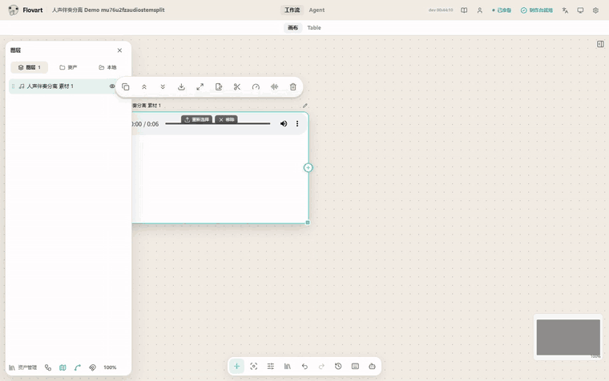
      <br /><sub><strong>Separate vocals and backing.</strong> Two audio nodes come out; this is stereo phase cancellation, so mono or heavily mixed material separates less cleanly.</sub>
    </td>
  </tr>
</table>

### The external-agent link

<table>
  <tr>
    <td align="center">
      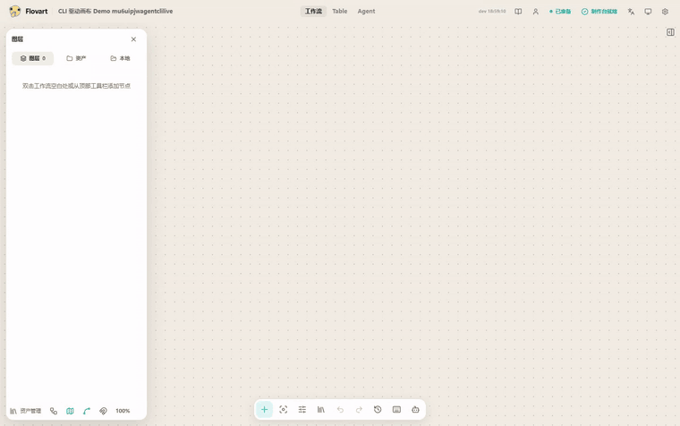
      <br /><sub><strong>Operations land on the canvas.</strong> <code>workflow.node.create</code> and <code>workflow.connect</code> run through the typed CLI while the visible Workflow updates in place — no screen scraping, no hidden copy of the project.</sub>
    </td>
    <td align="center">
      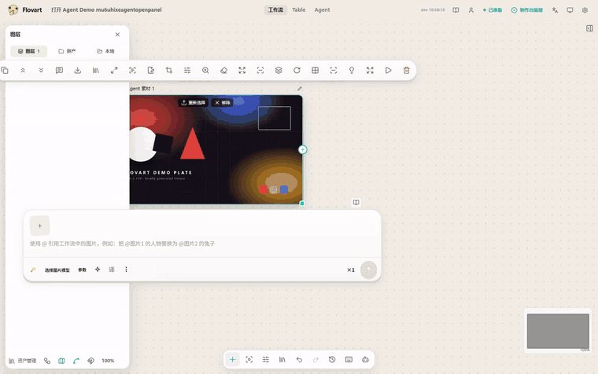
      <br /><sub><strong>Open the Agent surface.</strong> Reachable from the same canvas toolbar.</sub>
    </td>
  </tr>
</table>

Not filmed yet, and deliberately not shown: model-backed generation and the model-backed image tools (image generation, upscale, background removal, layer split, edit/outpaint) — this checkout configures no provider, so there is no honest result to record. That gap is logged in the [recording notes](docs/maintenance/readme/DEMO_RECORDING.md).

## Why Flovart?

Most AI creative tools make you choose between a visual editor and an autonomous agent. Flovart is built around one production state that both can use.

- **One live workflow.** You and your agent edit the same visible graph, the same assets and the same results.
- **Agent-native.** Agents act through typed Flovart operations instead of screen scraping, mouse automation, or a hidden copy of your project.
- **BYOK image + video.** Bring your own providers, models and API keys.
- **Local-first visual control.** Projects, references and workflow state stay close to your workspace.

## Core capabilities

| Capability | Flovart |
| --- | --- |
| Agent control | Typed operations against the actual visible Workflow |
| Human editing | The same graph, assets and results stay directly editable |
| Models | BYOK and multi-provider adapters, with capability-specific status |
| References | Graph connections, mentions, local assets and artifacts resolve into generation inputs |
| Automation | Explicit inspect/apply/run operations with revision and approval boundaries |
| Data | Local-first storage with documented browser and runtime boundaries |

Compose image, text, video, audio and configuration nodes, keep projects and references close to your workspace, and extend providers, hosts and node operations through explicit contracts. The product model is **Canvas** (the spatial Workflow surface; Table is a secondary view of the same project), **Inspector** (node/selection editing), and **Agent** (the 5-operation control surface). Canvas and Inspector are the primary surfaces; Table and Agent are real entries, but their remaining implementation work is not presented as complete — see [Features](docs/content/docs/overview/features.en.mdx).

## One workflow, human + agent

```text
Your Agent                  Codex · WorkBuddy · Claude Code
      │
      ▼
Flovart Operations          inspect · select · apply · run
      │
      ▼
Live Workflow  ──────────── Human
      │
      └──────────────────── Models
```

With your agent, a brief becomes explicit operations: it reads the current project and revision, applies them, and can run a confirmed node. By hand, you add, move, resize and connect nodes, drop in local files, configure a model, run generation and iterate visually. Both paths converge on the same Workflow authority, so nothing the agent does is invisible to you.

## Bring your own models

```text
Your provider → your API key → your assets + Workflow → your generated result
```

Flovart does not bundle model services. Configure a provider in the app, choose the capabilities and model you need, and keep the provider terms, cost and output rights in your own hands. OpenAI-compatible BYOK and remote-provider paths are Experimental: an adapter in the code is not a paid-provider certification.

## Integrations and compatibility

| Host or package | Status |
| --- | --- |
| Codex CLI + Browser Workflow | Experimental |
| Claude Code CLI projection | Experimental |
| OpenCode CLI projection | Experimental |
| DeepSeek Harness RC8 bundle/profile | Experimental |
| WorkBuddy CLI Connector | Experimental |
| CodeBuddy Code | Planned |
| Pi | Planned |
| Photoshop UXP panel | Experimental |
| Premiere Pro UXP panel | Experimental |
| After Effects | Experimental |
| DaVinci Resolve Studio | Experimental |

`Experimental`, `Planned` and External Gate items are not Stable claims. Evidence, boundaries and release gates live in the [Support Matrix](SUPPORT_MATRIX.md), which is the single source of truth; this table is not a second compatibility policy.

## Architecture

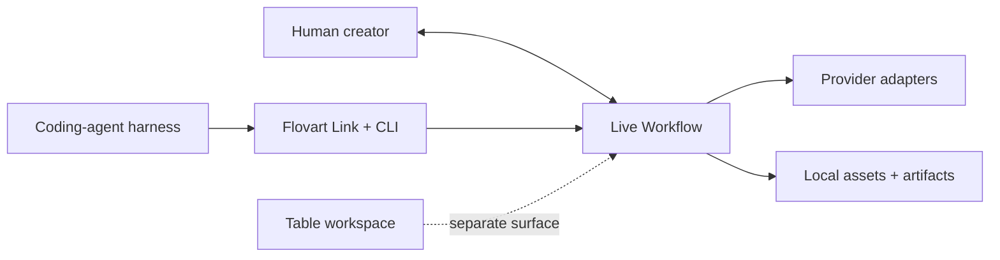

CLI and the experimental stdio MCP share operation semantics and the current Browser Workflow binding. Deterministic operations do not require a second AI to reinterpret them.

<p align="center">
  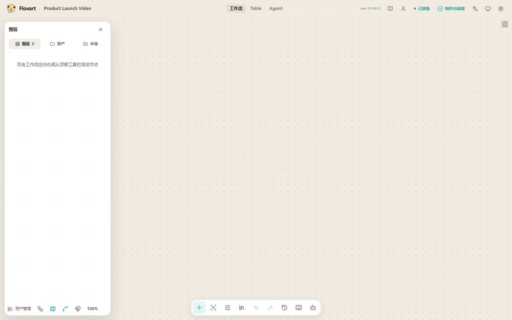
  <br />
  <sub><strong>The operation-level view of the same claim.</strong> A project and three nodes are created through
  <code>workflow.project.create</code>, <code>workflow.node.create</code> and <code>workflow.connect</code> (played at 1.5×) — the
  typed operations the external-agent session above drives end-to-end. Capture record:
  <a href="docs/maintenance/readme/DEMO_RECORDING.md">DEMO_RECORDING.md</a>.</sub>
</p>

Native-effect work keeps two short paths: one shared generation function produces durable media versions, and the host effect reads a fixed version and renders locally — no director/Operator/crew chain. Product scope, interactions, implementation and benchmarks live in the [main design](docs/design/flovart-native-effects.md); the [current implementation record](docs/design/ecosystem/CURRENT_ARCHITECTURE.md) describes existing code, not a second target architecture.

## Local-first and security

- Projects, assets and generation history are stored primarily in the browser today; cloud sync is not promised.
- The current Web path stores API keys locally through the encrypted `localforage` vault, while the frontend calls the configured model service directly. Treat the browser as part of the secret boundary.
- Web, Desktop WebView and extension storage are normally isolated. Cross-entry synchronization through a restricted runtime bridge is still pending.
- Never put API keys in a prompt, log or repository. Agent and CLI paths receive redacted readiness and capability state, not raw credentials.
- Use only the repository, the [live demo](https://avabbbb.github.io/Flovart/) and desktop artifacts published by the repository's Actions as official project channels. Review each provider's terms and the rights for your inputs and outputs.

Found a vulnerability? Report it privately through the [security policy](SECURITY.md).

## Creative App Roadmap

Native Flovart effects inside creative software remain planned, distinct from today's experimental panels, and the first target is Windows AE/PR: generate a version, refine it in the host, open Workflow for complex work. macOS will be evaluated separately rather than promised on the same schedule.

- validate AE/PR native effects with fixed assets, saved parameters and offline export;
- connect durable generation tasks and external/internal agent entry points through shared operations;
- extend to Photoshop and Resolve after the first host workflow is verified.

These are directions, not Stable support; follow [the roadmap](docs/content/docs/progress/todo.mdx) and [pending verification](docs/content/docs/progress/pending-test.mdx) for the evidence trail.

## Contributing

Contributions are especially useful in three areas: provider adapters, host integrations and Workflow capabilities. Open an [Issue](https://github.com/avabbbb/Flovart/issues/new/choose), read the [contribution conventions](.github/CONTRIBUTING.md), and include verification evidence with UI changes.

## Acknowledgements

Thanks to [@labiaaaaaaaaa](https://github.com/labiaaaaaaaaa) for driving third-party service compatibility and aggregation-endpoint fixes.

## License and disclaimer

Flovart is licensed under the [GNU Affero General Public License v3.0 only](./LICENSE). By using the project, you agree to the [Terms of Service](./docs/TERMS_OF_SERVICE.md) and [Privacy Policy](./docs/PRIVACY_POLICY.md).

Flovart does not bundle model services and makes no intellectual-property claim over generated content. You are responsible for the copyright, compliance and lawful use of your models, input assets and generated output. See [project data and statistics](stats/README.md).
