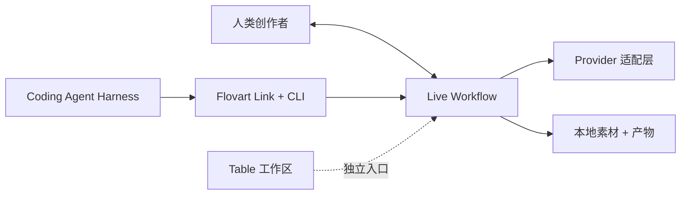

<p align="center">
  
</p>

<h1 align="center">Flovart</h1>

<p align="center">
  <strong>你的 Coding Agent，现在有一个可视化制作工作台。</strong>
</p>

<p align="center">
  开源、本地优先的工作区，你和你的 Coding Agent 操作同一份可见的 Workflow——<br />
  模型、API Key、素材和可复用的 Production Skill 都在你自己手里。
</p>

<p align="center">
  <a href="./README.md">English</a> · 简体中文
</p>

<p align="center">
  <a href="https://avabbbb.github.io/Flovart/"><strong>在线体验</strong></a> ·
  <a href="https://github.com/avabbbb/Flovart/releases"><strong>下载预览版</strong></a> ·
  <a href="docs/overview/quick-start.md">快速开始</a> ·
  <a href="SUPPORT_MATRIX.md">兼容性</a>
</p>

<p align="center">
  
  
  
  
  
  <a href="https://github.com/avabbbb/Flovart/releases"></a>
  <a href="https://github.com/avabbbb/Flovart"></a>
</p>

<p align="center">
  <a href="stats/README.md"></a>
  <br />
  <sub>README 展示次数 · 第三方计数，非独立访客</sub>
</p>

## 实际效果

<p align="center">
  
  <br />
  <sub><strong>外部 Agent 的操作，直接作用在同一份可见 Workflow 上。</strong><br />
  本地真实运行的录屏，1.5 倍速播放。一个项目和三个节点由 <code>workflow.project.create</code>、
  <code>workflow.node.create</code> 和 <code>workflow.connect</code> 创建，画布同步更新。
  完整可复现记录见 <a href="docs/maintenance/readme/DEMO_RECORDING.md">DEMO_RECORDING.md</a>。</sub>
</p>

<table>
  <tr>
    <td width="50%" align="center">
      
      <br />
      <sub>先选择制作方法，再进入项目。</sub>
    </td>
    <td width="50%" align="center">
      
      <br />
      <sub>运行前先了解调用方式、费用边界和安全信息。</sub>
    </td>
  </tr>
</table>

这段录屏展示的是这件事里 CLI 那一半；「具名 Coding Agent 自己的对话过程」的等价录屏仍然待补，见 [README_VISUAL_TODO.md](docs/maintenance/readme/README_VISUAL_TODO.md)。

## 为什么是 Flovart？

很多 AI 创作工具要求你在可视化编辑器和自主 Agent 之间二选一。Flovart 让两者共用同一份制作状态。

- **同一份活着的 Workflow。** 你和 Agent 改的是同一张图、同一批素材、同一个结果。
- **Agent-native。** Agent 通过类型化的 Flovart 操作工作，不靠屏幕抓取、鼠标自动化，也不会偷偷创建一份你的项目副本。
- **BYOK 图片与视频。** 模型服务、模型和 API Key 都用你自己的。
- **本地优先的可视化控制。** 项目、参考素材和 Workflow 状态都靠近你的工作区。

## 快速开始

### 创作者

1. 从 [GitHub Releases](https://github.com/avabbbb/Flovart/releases) 下载预览版。
2. 打开 Flovart，在设置中添加 AI 服务。
3. 新建或打开 Workflow，加入参考素材，开始创作。

公开 Releases 页面可能包含测试或预览产物；这不代表所有宿主或 Provider 都已 Stable。

### Coding Agent 用户

在版本化 CLI 包正式发布前，从源码检出运行：

```bash
git clone https://github.com/avabbbb/Flovart.git
cd Flovart
npm install
npm run flovart:cli -- start --source --web --open
npm run flovart:cli -- status --json
```

然后对本地 Agent 说：**「打开 Flovart，在这个 Workflow 上干活。」**

正常 Agent 循环是 `status`、`workflow.inspect`、`workflow.selection.get`、`workflow.apply` 和 `workflow.node.run`；连接准备和诊断用 `ensure` 和 `doctor`；仅供开发使用的浏览器检查见[快速开始](docs/overview/quick-start.md)。

## 核心能力

| 能力 | Flovart 的方式 |
| --- | --- |
| Agent 控制 | 通过类型化操作直接作用于真实可见 Workflow |
| 人类编辑 | 同一张图、素材和结果始终可以直接修改 |
| 模型 | BYOK 与多 Provider 适配，按具体能力标记状态 |
| 参考素材 | 图连接、提及、素材库和产物会解析成生成输入 |
| 制作知识 | 可复用 Production Skill，而不只是可复用 Prompt |
| 自动化 | 显式的 inspect/apply/run 操作，带版本与审批边界 |
| 数据 | 本地优先，并明确浏览器与 Runtime 的边界 |

你可以把图片、文本、视频、音频和配置节点组合起来，让项目和参考素材留在自己的工作区，并通过明确契约扩展 Provider、宿主、节点操作和 Skill。三个产品入口是：**Workflow** 负责生成编排，**Table** 负责仍在完善中的媒体预处理工作台，**Agent** 负责制作控制；Table 和 Agent 都已接入真实入口，但剩余实现工作尚未完成——详见[功能说明](docs/content/docs/overview/features.mdx)。

## 同一份 Workflow，人和 Agent 共用

```text
你的 Agent                  Codex · WorkBuddy · Claude Code
      │
      ▼
Flovart 操作                inspect · select · apply · run
      │
      ▼
活着的 Workflow  ────────── 人
      │
      └──────────────────── 模型
```

用 Agent 时，一句 brief 会变成明确的操作：它读取当前项目和版本，应用这些操作，并可以运行一个已确认的节点。手工创作时，你照样可以添加、移动、调整大小和连接节点，拖入本地文件，配置模型，运行生成并继续迭代。两条路最终落在同一个 Workflow 权威状态上，所以 Agent 做的事你都能看见。

## Production Skill

Prompt 是可复用的文字；Production Skill 是可复用的制作方法——视觉语言与风格规则、镜头结构与 Workflow 配方、检查点与人工确认、模型策略与成本边界，以及最终产物的验收标准。

仓库内已有 Flovart Skill 使用入口，以及 [VOX Skill 参考实现](https://github.com/avabbbb/vox-director)。更完整的社区契约仍在设计与实现中，所以这是正在发展的能力，不是已经成熟的 Skill 市场——可以从 [Skill 使用手册](docs/overview/skill-guide.md)开始。

## 使用你自己的模型

```text
你的 Provider → 你的 API Key → 你的素材 + Workflow → 你的生成结果
```

Flovart 不内置模型服务。你可以在应用中配置 Provider，按需选择能力和模型，并自行承担 Provider 条款、费用和产物权利。OpenAI-compatible BYOK 与远程 Provider 路径当前为 Experimental：代码里有适配器，不等于真实付费服务已认证。

## 集成与兼容性

| Host 或 package | 当前状态 |
| --- | --- |
| Codex CLI + Browser Workflow | Experimental |
| Claude Code CLI projection | Experimental |
| OpenCode CLI projection | Experimental |
| DeepSeek Harness RC8 bundle/profile | Experimental |
| WorkBuddy CLI Connector + Skill | Experimental |
| CodeBuddy Code | Planned |
| Pi | Planned |
| Photoshop UXP panel | Experimental |
| Premiere Pro UXP panel | Experimental |
| After Effects | Experimental |
| DaVinci Resolve Studio | Experimental |

`Experimental`、`Planned` 和 External Gate 都不是 Stable 能力。证据、边界与发布门槛统一记录在 [Support Matrix](SUPPORT_MATRIX.md)，那里是唯一的事实来源；这张表不是第二套兼容性政策。

## 架构



CLI 与实验性 stdio MCP 共用操作语义，当前都绑定可见的 Browser Workflow。确定性操作直接执行，不需要第二个 AI 再解释一遍。

原生效果保持两条短路径：同一生成函数产出持久素材版本，宿主效果读取固定版本并本地渲染——不强制经过导演、Operator 或制作组层级。产品、交互、实现和评测集中在[主设计](docs/design/flovart-native-effects.md)；[当前实现记录](docs/design/ecosystem/CURRENT_ARCHITECTURE.md)只解释现有代码，不是另一套产品目标。

## 本地优先与安全

- 当前项目、素材和生成历史主要保存在浏览器本地，不承诺云同步。
- 当前 Web 路径通过加密的 `localforage` Vault 在本地保存 API Key，前端再直接请求配置的模型服务；浏览器属于秘密边界的一部分。
- Web、桌面 WebView 和扩展的存储通常彼此隔离；通过受限 Runtime Bridge 跨入口同步仍在待办中。
- 不要把 API Key 写进 Skill、Prompt、日志或仓库。Agent 和 CLI 只能拿到脱敏后的就绪与能力状态，不能拿到原始凭据。
- 官方项目渠道仅包括本仓库、[在线 Demo](https://avabbbb.github.io/Flovart/) 和本仓库 Actions 发布的桌面产物。请自行确认 Provider 条款，以及输入素材和输出内容的版权与合规性。

## 创作软件路线图

深入创作软件的 Flovart 原生效果仍是规划开发，与当前的实验性面板不是一回事；首版目标优先 Windows AE/PR：生成一个版本，在宿主内继续精修，复杂任务再展开 Workflow。macOS 会单独排期验证，不承诺同期支持。

- 用固定素材验证 AE/PR 原生效果、参数保存与离线导出；
- 接入持久生成任务和外部/内部 Agent 入口，共用操作能力；
- 首条宿主流程通过后再接 Photoshop 与 Resolve。

这些是方向，不是 Stable 支持。证据进度见[开发计划](docs/content/docs/progress/todo.mdx)和[待用户确认](docs/content/docs/progress/pending-test.mdx)。

## 参与贡献

我们尤其欢迎四类贡献：Provider 适配、Production Skill、宿主集成和 Workflow 能力。请先提交 [Issue](https://github.com/avabbbb/Flovart/issues/new/choose)，阅读[贡献约定](.github/CONTRIBUTING.md)，UI 变更附上验证证据。

## 致谢

感谢 [@labiaaaaaaaaa](https://github.com/labiaaaaaaaaa) 推进第三方服务适配与聚合端点修复。

## 协议与声明

Flovart 基于 [GNU Affero General Public License v3.0 only](./LICENSE) 开源。使用本项目即表示同意[使用条款](./docs/TERMS_OF_SERVICE.md)和[隐私政策](./docs/PRIVACY_POLICY.md)。

Flovart 不内置模型服务，也不对生成内容主张知识产权。你需要自行确认所选模型、输入素材和生成结果的版权、合规性与合法使用。更多信息见[项目数据与统计](stats/README.md)。
