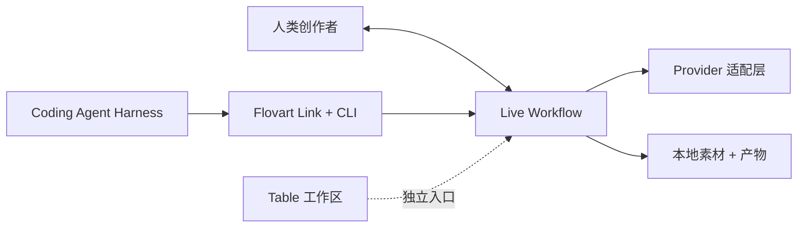

<p align="center">
  
</p>

<h1 align="center">Flovart</h1>

<p align="center">
  <strong>让你的 Coding Agent 真正拥有一个可视化制作工作台。</strong>
</p>

<p align="center">
  Flovart 是一个开源、本地优先、Agent-native 的 AI 图片与视频制作工作区。<br />
  让 Codex、Claude Code 等本地 Agent 检查、编辑并运行你正在看、也能继续修改的同一份 Workflow——模型、API Key、素材和可复用 Production Skill 都由你掌握。
</p>

<p align="center">
  <a href="./README.md">English</a> · 简体中文
</p>

<p align="center">
  <a href="https://avabbbb.github.io/Flovart/"><strong>在线体验</strong></a> ·
  <a href="https://github.com/avabbbb/Flovart/releases"><strong>下载预览版</strong></a> ·
  <a href="docs/overview/quick-start.md">快速开始</a> ·
  <a href="SUPPORT_MATRIX.md">兼容性</a>
</p>

<p align="center">
  
  
  
  
  
  <a href="https://github.com/avabbbb/Flovart/releases"></a>
  <a href="https://github.com/avabbbb/Flovart"></a>
</p>

<p align="center">
  <a href="stats/README.md"></a>
  <br />
  <sub>README 展示次数 · 第三方计数，非独立访客</sub>
</p>

## 工作区一览

<p align="center">
  
  <br />
  <sub>真实 Workflow 界面：组织参考素材、生成节点、连接和结果。</sub>
</p>

<table>
  <tr>
    <td width="50%" align="center">
      
      <br />
      <sub>先选择制作方法，再进入项目。</sub>
    </td>
    <td width="50%" align="center">
      
      <br />
      <sub>运行前先了解调用方式、费用边界和安全信息。</sub>
    </td>
  </tr>
</table>

当前展示的都是实际 Workflow 和 Skill 界面。未来“Agent 操作同一份 Workflow”的录屏规格见 [README_VISUAL_TODO.md](docs/maintenance/readme/README_VISUAL_TODO.md)；本 README 不伪造尚未具备的视觉证据。

## 为什么是 Flovart？

很多 AI 创作工具要求你在可视化编辑器和自主 Agent 之间二选一。Flovart 让两者使用同一份制作状态：

- **Agent-native：** Coding Agent 通过类型化的 Flovart Link 和 CLI 操作可见 Workflow，不靠鼠标自动化，也不创建隐藏副本。
- **人类可编辑：** 节点、连接、素材和产物继续留在你能检查、能修改的 Workflow 里。
- **BYOK 与多 Provider：** 使用你自己的模型服务和 API Key；尚未认证的真实 Provider 与计费行为会明确标为 Experimental。
- **Production Skill：** 把视觉语言、镜头规则、Workflow 配方、检查点和验收标准封装成可复用的制作方法。

## 同一个工作区，两种创作方式

### 让 Agent 协作

```text
创作 Brief
      ↓
Codex / Claude Code / OpenCode
      ↓
Flovart Link + CLI
      ↓
检查 · 应用 · 运行
      ↓
可见 Workflow
```

例如：

> “打开 Flovart，用这些参考素材搭建一个三镜头产品视频 Workflow。”

Agent 会读取当前项目和版本，在明确的操作边界内修改，并在确认后运行节点。不同 Host 的真实状态见 [Support Matrix](SUPPORT_MATRIX.md)。

### 手动创作

你仍然可以添加、移动、调整大小和连接节点，拖入本地图片或视频，配置模型，运行生成，检查产物并继续迭代。不存在一份单独的“Agent 版本”项目：人和 Agent 最终操作的是同一个 Workflow 权威状态。

## Flovart 与普通工具有什么不同？

| 能力 | Flovart 的方式 |
| --- | --- |
| Agent 控制 | 通过类型化操作直接作用于真实可见 Workflow |
| 人类编辑 | 同一张图、素材和结果始终可以直接修改 |
| 模型 | BYOK 与多 Provider 适配，按具体能力标记状态 |
| 参考素材 | 图连接、提及、素材库和产物会解析成生成输入 |
| 制作知识 | 可复用 Production Skill，而不只是可复用 Prompt |
| 自动化 | 显式的 inspect/apply/run 操作，带版本与审批边界 |
| 数据 | 本地优先，并明确浏览器与 Runtime 的边界 |

## 可以做什么

- **Agent-native Workflow：** 将图片、文本、视频、音频和配置节点组合成可视化生成流程。
- **图片与视频生成：** 选择模式、参考素材和参数，在 Workflow 中查看结果与恢复状态。
- **参考驱动制作：** 将图连接、提及、素材和生成产物作为类型化输入组合，而不是把所有内容塞进一个 Prompt。
- **Production Skill：** 在不同项目中复用一套视觉语言、镜头结构或制作检查清单。
- **本地项目与素材：** 项目、参考素材和生成历史主要留在当前工作区，不承诺云同步。
- **可扩展契约：** Provider、Host、节点操作和 Skill 都有明确契约；Mock 通过不等于真实宿主认证通过。

这套产品故事背后的三个入口是：**Workflow** 负责生成编排，**Table** 负责仍在完善中的媒体预处理工作台，**Agent** 负责空间化制作控制。Table 和 Agent 都已接入真实应用入口，但它们剩余的实现与迁移工作尚未完成；详见[功能说明](docs/content/docs/overview/features.mdx)。

## Production Skill

Prompt 是可复用的文字。

Production Skill 是可复用的制作方法。一个 Skill 可以封装：

- 视觉语言和风格规则；
- 镜头结构与 Workflow 配方；
- 检查点和人工确认；
- 模型策略、成本边界和安全规则；
- 最终产物的验收标准。

仓库内已有 Flovart Skill 使用入口，以及 [VOX Skill 参考实现](https://github.com/avabbbb/vox-director)。更完整的社区契约和生态仍在设计与实现中，所以这里展示的是正在发展的能力，不是已经成熟的 Skill 市场。可以从[Skill 使用手册](docs/overview/skill-guide.md)开始。

## 使用你自己的模型

```text
你的 Provider
      ↓
你的 API Key
      ↓
你的素材 + Workflow
      ↓
你的生成结果
```

Flovart 不内置模型服务。你可以在应用中配置 Provider，按需选择能力和模型，并自行承担 Provider 条款、费用和产物权利。OpenAI-compatible BYOK 与远程 Provider 路径当前为 Experimental；代码里有适配器，不等于真实付费服务已认证。状态以 [Support Matrix](SUPPORT_MATRIX.md) 为准。

## 兼容性

| Host 或 package | 当前状态 |
| --- | --- |
| Codex CLI + Browser Workflow | Experimental |
| Claude Code CLI projection | Experimental |
| OpenCode CLI projection | Experimental |
| DeepSeek Harness RC8 bundle/profile | Experimental |
| WorkBuddy CLI Connector + Skill | Experimental |
| CodeBuddy Code | Planned |
| Pi | Planned |
| Photoshop UXP panel | Experimental |
| Premiere Pro UXP panel | Experimental |
| After Effects | Experimental |
| DaVinci Resolve Studio | Experimental |

`Experimental`、`Planned` 和 External Gate 都不是 Stable 能力。证据、边界与发布门槛统一记录在 [Support Matrix](SUPPORT_MATRIX.md)，这里不再复制第二套兼容性政策。

## 快速开始

### 创作者

1. 从 [GitHub Releases](https://github.com/avabbbb/Flovart/releases) 下载预览版。
2. 打开 Flovart，在设置中添加 AI 服务。
3. 新建或打开 Workflow，加入参考素材，开始创作。

公开 Releases 页面可能包含测试或预览产物；这不代表所有 Host 或 Provider 都已 Stable。

### Coding Agent 用户

在版本化 CLI 包正式发布前，使用仓库已经验证的源码路径：

```bash
git clone https://github.com/avabbbb/Flovart.git
cd Flovart
npm install
npm run flovart:cli -- start --source --web --open
npm run flovart:cli -- workflow.inspect --json
```

然后对本地 Agent 说：**“打开 Flovart。”** 正常 Agent 循环只需要 `status`、`workflow.inspect`、`workflow.selection.get`、`workflow.apply` 和 `workflow.node.run`；开发诊断与隔离浏览器检查见[快速开始](docs/overview/quick-start.en.md)。

## 架构



理解产品之后，再看三个实现术语：

- **External Coding Agent Harness：** 负责主会话和长程计划的导演台。
- **Workspace Operator：** 唯一内置执行 Agent，只在有界 Intent 内使用类型化工具。
- **Production Crew：** Operator 与确定性 Dispatcher、Runtime、Provider 服务的集合名，不是第三个 Agent。

完整协议、状态边界和迁移说明见 [生态架构设计包](docs/design/ecosystem/TARGET_ARCHITECTURE.md) 与 [当前架构记录](docs/design/ecosystem/CURRENT_ARCHITECTURE.md)。

## 本地优先与安全

- 当前项目、素材和生成历史主要保存在浏览器本地，不承诺云同步。
- 当前 Web 路径通过加密的 `localforage` Vault 在本地保存 API Key，前端再直接请求配置的模型服务；浏览器属于秘密边界的一部分。
- Web、桌面 WebView 和扩展的存储通常彼此隔离；通过受限 Runtime Bridge 跨入口同步仍在待办中。
- 不要把 API Key 写进 Skill、Prompt、日志或仓库。Agent 和 CLI 只能获得脱敏后的就绪/能力状态，不能拿到原始凭据。
- 官方项目渠道仅包括本仓库、[在线 Demo](https://avabbbb.github.io/Flovart/) 和本仓库 Actions 发布的桌面产物。请自行确认 Provider 条款，以及输入素材和输出内容的版权与合规性。

## 路线图

接下来面向产品的三个方向是：

- 完善 Agent Host 的认证、恢复和可见 Workflow 认证；
- 扩展 Table 媒体预处理工作台与 Production Skill 生态；
- 完成创意宿主 package 及真实产物导入路径的认证。

这些是方向，不是当前 Stable 支持。证据进度见[开发计划](docs/content/docs/progress/todo.mdx)和[待用户确认](docs/content/docs/progress/pending-test.mdx)。

## 参与贡献

我们尤其欢迎四类贡献：Provider 适配、Production Skill、Host 集成和 Workflow 能力。请先提交 [Issue](https://github.com/avabbbb/Flovart/issues/new/choose)，阅读[贡献约定](.github/CONTRIBUTING.md)，UI 变更附上验证证据。

## 致谢

感谢 [@labiaaaaaaaaa](https://github.com/labiaaaaaaaaa) 推进第三方服务适配与聚合端点修复。

## 协议与声明

Flovart 基于 [GNU Affero General Public License v3.0 only](./LICENSE) 开源。使用本项目即表示同意[使用条款](./docs/TERMS_OF_SERVICE.md)和[隐私政策](./docs/PRIVACY_POLICY.md)。

Flovart 不内置模型服务，也不对生成内容主张知识产权。你需要自行确认所选模型、输入素材和生成结果的版权、合规性与合法使用。更多信息见[项目数据与统计](stats/README.md)。
