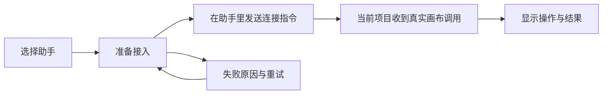

# 本地助手接入与创作软件插件

状态：代码与自动化链路已落地，等待第三方宿主/账号外部门槛。本文件是本轮体验重设计和插件交付的主计划；不代表宿主已通过内测。进度以实际代码、运行记录及 [待测试确认](../content/docs/progress/pending-test.mdx) 为准。

## 交付目标

让用户在当前创作项目里选择 Codex、WorkBuddy 或 DeepSeek Harness，完成接入并看到第一项真实画布操作。提供同系列 Photoshop、Premiere、After Effects、DaVinci Resolve 插件，让选中素材进入 Flovart，经过处理和预览后回到宿主。Workflow、Table、Agent 保持现有产品分工。

完整完成条件包括调研、可理解的交互、真实入口实现、插件包、失败恢复、自动化回归和宿主实测。只通过构建、提供空壳面板或 CLI 模拟均不算内测就绪。

## 当前问题及证据

| 当前代码 | 用户遇到的问题 | 修正 |
| --- | --- | --- |
| `AgentHostPicker` 根据数组长度保留发现结果 | 安装或卸载助手后重新扫描仍显示旧状态 | 使用最新完成的发现结果，忽略过期请求 |
| 选择第一个可用助手自动显示勾选，准备只发生在 select change | 默认 Codex 看似可用却没有执行准备 | 选择、准备、真实调用分别显示 |
| 下拉切换即写文件并移交写入权 | 想查看助手选项却改变控制者 | 选择无副作用，明确按钮才准备和切换 |
| 离线仅显示“等待本机 Agent” | 无法知道如何启动 | 可复制给所选助手的完整启动指令；无需填写端口或 Token |
| WorkBuddy 固定 `planned` 且 disabled | 无法使用官方 Skill 导入能力 | 提供自包含 ZIP，显示待导入及待验证状态 |
| Workflow 制作面板只有架构说明和统计 | 在正在使用的画布内找不到接入动作 | 同一引导直接挂载在 Workflow 制作面与 Agent 入口 |

## 助手交互

默认显示 Codex、WorkBuddy、DeepSeek Harness 三个具名选择，其他助手折叠。保留用户选择，未检测到 CLI 不等于桌面应用未安装。登录继续由各助手管理。



- Codex：一次明确操作准备 Skill 并激活当前页面、当前助手；新页面通过一次性 bootstrap 自动绑定，URL 不保留凭据。真实 Codex 登录状态仍由 Codex 自己管理。
- WorkBuddy：下载一个包含入口与操作参考的 ZIP，在官方“技能 → 添加技能 → 上传技能”导入；桌面程序、登录和 Skill 是否加载不能从 PATH 推断，也不冒充 CodeBuddy Code 或 Director Runtime Binding。
- DeepSeek Harness：使用 RC8 Plugin/Profile 的 Browser-only `conversation.view`，只投影当前可见 Browser Workflow。用户在当前会话选择或创建项目，准备失败可重试；不得要求手填 URL、Token、Session ID，不把 `#/dock` 当主工作区。
- 切换助手或页面时，按钮说明将接管当前项目；只有用户点击才转移写入权。刷新保留选项，连接状态来自服务。断开、鉴权失败、项目切换、旧请求晚到都不能保留假成功。
- “准备完成”只表示 Skill/页面已准备。“收到助手操作”必须有当前项目的真实调用或回执；PATH 检测、复制指令、下载包、前端选择不证明对话连接成功。
- Provider 配置放到第一次需要生成时；现有 Plus/OAuth 和代理不参与 Flovart 的导入或改写。只需编辑画布时，不应被 API Key 引导阻断。

## 宿主插件交互

默认方案为可停靠的紧凑“Flovart”面板，宽度约 320–480 px；窄宽度纵向排布。用户仍可展开画布做编排。宿主的选择、时间码、图层/剪辑名称出现在素材区，处理参数采用折叠段。主题由宿主适配到共享 token。

```text
Flovart                     当前项目
素材    选中的图层 / 剪辑 / 合成
        [导入选中素材]
处理    预设 / 参数 / 参考素材
结果    预览、进度、失败原因、取消
        [应用到当前宿主]
        展开画布
```

“应用”必须绑定导入时的宿主文档/序列/合成和对象标识；用户切换项目后重新确认目标。异步结果不直接覆盖源素材。首次提供新增图层/导入素材的可逆路径，后续明确选中输出再替换。宿主撤销与 Flovart 操作记录分别真实保留。

| 宿主 | 首选实现 | 需要验证的宿主能力 |
| --- | --- | --- |
| Photoshop | UXP panel，复杂画布使用受限 WebView | `dist-studio/photoshop` 已实现；选中图层/选区、像素导出、`executeAsModal` 内新增图层、撤销、主题仍需真实宿主 tracer |
| Premiere 25.6+ | UXP panel | `dist-studio/premiere` 已实现；选中片段、序列/媒体信息、导入结果、插入时码、事务/撤销仍需真实宿主 tracer |
| After Effects | CEP panel + ExtendScript | `dist-studio/after-effects` 已实现；合成/图层上下文、帧或素材导出、结果导入、Undo Group 仍需真实宿主 tracer |
| Resolve Studio | Workflow Integration + 官方 JavaScript SDK | `dist-studio/resolve` 已实现；媒体池/时间线读写、片段范围、结果导入和停靠能力仍需 Studio 实测 |

Resolve 的 Workflow Integration 不等同于 Inspector 内嵌效果控件；若用户要求原生 Inspector/逐帧实时效果，需单独实现 OFX/C++ 参数插件，并验证异步生成的缓存/渲染行为。不能把 Electron 独立窗口包装成已实现的 Inspector 内嵌功能。宿主版本和 Resolve Studio 资格等待内测环境确认。

共享部分是面板布局、处理状态、预览和画布逻辑。宿主适配层只负责选择、导入导出、主题、撤销和生命周期；Provider、任务和 Artifact 使用现有 Runtime。桥接使用版本化白名单消息和明确目标校验，不允许任意脚本执行或将密钥传进 WebView。离线时保留可解释错误和已有结果。

## 调研依据

- [Codex Skills](https://developers.openai.com/codex/skills)：本地 `.agents/skills`、显式/自动触发和插件分发。无需新建另一套 Codex 登录。
- [WorkBuddy 官方技能说明](https://www.codebuddy.cn/docs/workbuddy/From-Beginner-to-Expert-Guide/Function-Description/Skills-Market) 与 [技能包结构](https://open.workbuddy.cn/en/docs/skill)：本地包上传和 `SKILL.md`。文档搜索可读取正文，直连读取存在超时；实际导入仍须客户端验证。
- [DeepSeek 官方 Harness](https://deepseek.com/harness/en/)：开发预览、Cordis 插件、UI 可扩展。现有 Flovart 依赖锁定 RC8，升级兼容不能仅由官网描述证明。
- [Photoshop WebView](https://developer.adobe.com/photoshop/uxp/2022/uxp/reference-js/Global%20Members/HTML%20Elements/HTMLWebViewElement/)：manifest v5、域名与消息桥权限，本地内容需相应 UXP 版本。
- [Premiere UXP 入门](https://developer.adobe.com/premiere-pro/uxp/plugins/) 与 [Adobe 官方说明](https://developer.adobe.com/premiere-pro/uxp/introduction/)：Premiere 25.6 起正式使用 UXP。
- [After Effects 开发入口](https://developer.adobe.com/after-effects/)：面板、脚本和插件是不同能力面，按实际 SDK 实现。
- [Blackmagic 功能表](https://documents.blackmagicdesign.com/SupportNotes/DaVinci_Resolve_Studio_Features.pdf)：Workflow Integration 的 Studio 边界；精确 SDK/API 以安装包中的 Developer 文档继续核对。
- OpenDesign 存在多个同名项目：[manalkaff/opendesign](https://github.com/manalkaff/opendesign) 提供结构化需求引导，[dporkka/opendesign](https://github.com/dporkka/opendesign) 提供独立设计工作区。用户使用的具体项目待确认；当前借鉴“识别环境、一个下一步、能看到结果”的原则，不导入其凭据读取实现。

## 实施与验收清单

| 交付项 | 必须提供的证据 | 当前状态 |
| --- | --- | --- |
| 助手引导及发现错误修复 | 默认选择、离线恢复、状态竞态、失败可见性及 Chrome for Testing smoke | 自动化通过；待用户确认 |
| Codex | bootstrap → visible Workflow → CLI inspect，刷新恢复 | 本机通过；真实登录 conversation External Gate |
| WorkBuddy | ZIP 自包含、官方形状 schema/clean fixture、真实客户端导入与命令 | package 通过；客户端/NL tracer External Gate |
| DeepSeek Harness | Browser-only contextual view、稳定工具、profile build/install、失败闭环 | contract/build 通过；真实登录、页面 tracer、升级回滚 External Gate |
| 四款创作宿主 | Photoshop/Premiere UXP、AE CEP、Resolve Workflow Integration package 与共享 inspector | package/contract 通过；真实面板、素材导入、撤销 External Gate |
| 文档清理 | 主索引无矛盾流程；完成项进入 pending-test，过时 Native/Host Projection 文案降为历史 | 已完成本轮收口；最终候选仍需复核 |
| 版本内测 | 类型/构建、全量测试、Chrome 动态端口实际路径、宿主矩阵、失败可见性 | 本机自动化候选通过；第三方宿主/登录/发布门禁未通过，不宣布完成 |

按以上顺序持续推进，已完成的自动化检查不替代缺失的宿主、登录态或付费 Provider 验证。明确区分代码完成、自动化通过和用户实机确认。
