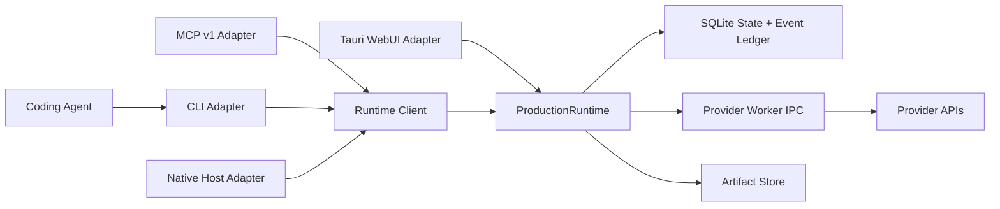

# Production Runtime V1 实施规划

## 状态

本文件是已确认方向的实施规划。S0.1 Canonical Contract + Runtime Kernel 已实现并进入待测试状态；S0.2 及后续批次仍未实现，不得把规划内容当作现有能力。架构决策见：

- [ADR 0034：V1 将成片制作权威保留在用户本机](../adr/0034-keep-production-authority-local.md)
- [ADR 0035：在原子运行时命令之上保留生产意图命令](../adr/0035-layer-production-intents-over-atomic-runtime-commands.md)
- [ADR 0036：向 Agent 暴露 Provider-neutral Capability 而不是 Provider Job](../adr/0036-expose-provider-neutral-capabilities-to-agents.md)
- [ADR 0044：允许用户验证本地 BYOK Route Mapping](../adr/0044-allow-verified-local-byok-route-mapping.md)
- [ADR 0045：以 ProductionSpec 作为制作计划权威](../adr/0045-make-production-spec-authoritative-over-workflow-projection.md)
- [ADR 0046：每个 ProductionSession 至多绑定一个 Production Skill](../adr/0046-bind-at-most-one-primary-skill-per-production-session.md)
- [ADR 0047：通过 Runtime 介入事件唤醒 Coding Agent](../adr/0047-wake-agents-from-runtime-intervention-events.md)
- [ADR 0056：以内嵌 PI Agent Core 实现 Flovart Agent](../adr/0056-use-pi-agent-core-for-the-built-in-flovart-agent.md)
- [Flovart Agent V1 实施规划](flovart-agent-v1-plan.md)
- [Production Runtime 数据契约](production-runtime-data-contract.md)
- [Production Runtime S0/S1 施工清单](production-runtime-s0-s1-work-items.md)
- [领域词汇](../../CONTEXT.md)

## V1 目标

让内置 Flovart Agent 或接入的外部 Coding Agent 使用可选 Production Skill，并通过 Flovart Skill 或同一 Runtime 契约提交生产意图，立即拿到持久任务句柄，在 WebUI 关闭、CLI 断开或 Desktop Runtime 重启后继续查询、观察、取消或恢复；Provider 凭据始终不离开 Desktop Runtime 与受控 Provider Worker。

首个可放行垂直切片定义为：

1. CLI 或 WebUI 提交一次图片生成意图。
2. Desktop Runtime 在返回前持久化 Command、Task、StageRun 和事件。
3. Runtime 使用 `credentialRef` 调用 Provider Worker，不向调用方返回 Secret。
4. Provider 结果被下载并写入 Artifact Store。
5. Runtime 以带 revision 的原子操作更新 Workflow Project。
6. 关闭 WebUI或重启 Desktop Runtime 后，任务和结果仍可查询。
7. CLI、MCP 与 WebUI 从同一 Runtime Module 得到一致状态。

图片切片通过后，再按同一接口增加视频、语音、音乐、渲染和验证；不先造一套无法证明恢复语义的全命令表。

## 非目标

- V1 不把 Production Authority 放到云端 Hub。
- Production Skill 不接触 Provider Secret、Provider HTTP endpoint 或任意 Shell。
- 不让 WebUI 继续承担长任务执行权威。
- 不为尚未存在的远程 Runtime、集群调度或跨设备同步预留复杂抽象。
- 不直接依赖仍在变化的 MCP Tasks 实验接口；MCP 是 Runtime 的 Adapter。
- 本轮规划不恢复或重写 Canvas、Table、Workflow 的视觉界面。

## 当前阻断

1. CLI 同时存在 local、shadow file-state 和 browser file-bridge 三条执行路径，没有唯一 Production Authority。
2. Tauri `BridgeQueue` 是内存队列，只把 enqueue/complete 摘要写入 `sync_log`，没有实际的持久 Task、租约和重启恢复。
3. 当前固定端口 HTTP 可以读取原始 API Key，也没有启动期 Bearer Token 鉴权。
4. `workflow.node.run` 把 Prompt、引用解析、预算、Provider、下载、Artifact 和图更新揉成一个浏览器内复合操作。
5. CLI registry、MCP 描述、Flovart Skill 文档和真实命令集存在漂移。
6. 当前 Workflow Project 真相仍偏向浏览器持久化，Runtime 无法在 WebUI 关闭时安全提交 revision 更新。

## 深 Module 与 seam

### 外部 Module

建立一个 `ProductionRuntime` Module。它的 Interface 只有五类操作：

```text
submit(commandEnvelope)        -> CommandResult | TaskReceipt
getTask(taskId)                -> RuntimeTask
listTasks(filter, cursor)      -> RuntimeTaskPage
cancelTask(taskId, reason)     -> RuntimeTask
streamEvents(afterEventId)     -> RuntimeEventStream
```

所有命令种类都是 `commandEnvelope.command` 的封闭联合，不为每个命令再创建一层浅转发 Module。调用方和测试都只跨越这个 seam。



### Adapter

| Adapter | 用途 | 约束 |
| --- | --- | --- |
| Tauri WebUI Adapter | 主窗口调用 Runtime | 使用 Tauri capability/permission，只传类型化命令 |
| Local HTTP Adapter | CLI、MCP 和本机 Agent | 随机 loopback 端口、启动期 Bearer Token、协议握手 |
| Native Host Adapter | Chrome/Edge 扩展 | 从 Runtime Discovery Record 发现端口，不读取 Secret |
| In-Memory Adapter | Runtime 集成测试 | 与生产 Adapter 使用同一 Interface，不测试内部实现 |
| Provider Worker Adapter | Runtime 调用现有 TypeScript Provider 能力 | 私有 JSONL stdio，只在请求执行时注入所需 Secret |

## 命令契约

### CommandEnvelope

```json
{
  "protocolVersion": "1",
  "commandId": "cmd_...",
  "command": "generate.image",
  "args": {},
  "source": "cli",
  "idempotencyKey": "user-or-agent-stable-key",
  "expectedRevision": 12,
  "productionSessionId": "ps_..."
}
```

规则：

- 所有写操作必须有 `idempotencyKey`。
- 同一 source 与 idempotency key 重试时返回原 receipt；payload 不同则返回冲突。
- 图变更必须带 `expectedRevision`，过期时返回当前 revision，不做静默覆盖。
- `args` 必须由 registry 中的封闭 JSON Schema 校验；禁止通用任意 `patch` 进入 Provider 或图核心字段。
- Secret 只能通过 `credentialRef` 在 Runtime 内解析。

### 返回值

同步原子命令：

```json
{
  "kind": "result",
  "commandId": "cmd_...",
  "eventId": 101,
  "data": {}
}
```

长任务：

```json
{
  "kind": "task",
  "commandId": "cmd_...",
  "taskId": "task_...",
  "status": "working",
  "pollIntervalMs": 1000,
  "eventId": 102
}
```

`TaskReceipt` 必须在 Provider 网络请求之前提交到 SQLite。

### 命令分层

| 层 | 示例 | 谁可以调用 |
| --- | --- | --- |
| Production Intent | `production.run`、`workflow.node.run`、`generate.image`、`generate.video` | Agent、CLI、MCP、WebUI |
| Atomic Runtime | `workflow.node.move`、`workflow.connect`、`artifact.import`、`capability.submit` | Flovart Skill、第一方 UI、受控 operator |
| Private Provider IPC | `provider.submit`、`provider.poll`、`provider.cancel` | 仅 Desktop Runtime |

推荐把公开原子生成 seam 定义为 Provider-neutral 的 `capability.submit`，输入为 Capability Requirement；Provider Job 是 Runtime 内部的 ProviderAttempt，不向社区 Production Skill 暴露 Provider endpoint。

## Runtime Task 生命周期

Runtime Task 使用以下封闭状态：

```text
queued -> working -> completed
                  -> input_required -> working
                  -> failed
                  -> cancelled
```

`submission_unknown` 不是 Task 终态，而是 ProviderAttempt 状态；对应 StageRun 进入 blocked，Task 进入 `input_required`，禁止自动重复提交可能已经计费的请求。

恢复规则：

- Worker 领取任务时写入 `lease_owner` 和 `lease_expires_at`。
- Worker 定期续租；Runtime 启动时扫描过期 lease。
- 纯本地且幂等的步骤可以重新入队。
- 已持久化 `external_job_id` 的 ProviderAttempt 恢复轮询。
- 网络提交结果不确定且没有 Provider 幂等保证时进入 `submission_unknown`。
- Cancel 是协作式请求；只有 Provider 确认取消后才显示 Provider Job 已取消，否则显示“已停止等待”。

## SQLite 状态模型

V1 直接建立新表，不把现有 `sync_log` 伪装成 ProductionRun 数据库。

| 表 | 责任 |
| --- | --- |
| `command_receipts` | CommandEnvelope、payload hash、idempotency key 与首次 receipt |
| `runtime_tasks` | Task 状态、结果、错误、lease、取消请求与保留期限 |
| `production_runs` | ProductionSpec Revision 的一次实际执行 |
| `stage_runs` | 能力阶段、依赖、阻塞、重试与输出 |
| `provider_attempts` | Route 快照、request hash、external job ID、提交/轮询生命周期 |
| `artifacts` | 内容哈希、媒体类型、尺寸、时长、存储位置 |
| `artifact_inputs` | Artifact 来源依赖和角色 |
| `production_spec_revisions` | 不可变 ProductionSpec Core、Extension、版本与内容哈希 |
| `workflow_projects` | Workflow 工作区身份和当前 ProductionSession，不保存第二份权威制作计划 |
| `workflow_plan_projections` | 从 Spec/Run 派生的可重建节点投影 |
| `workflow_layouts` | 节点位置、折叠、视口和独立 layout revision |
| `runtime_events` | 单调事件 ID、实体、事件类型和 payload |

完整列、唯一约束、路由/审批/预算/Agent 表与 JSON 契约见 [Production Runtime 数据契约](production-runtime-data-contract.md)。

关键事务：

1. 接受命令：receipt、task/run/stage 与首个事件同事务提交。
2. Provider 提交前：ProviderAttempt 与 Cost Reservation 先提交。
3. Provider 返回：Attempt 状态、Artifact、StageRun、Workflow revision 与事件同事务提交。
4. 每个查询读 State Projection；SSE 从 `runtime_events` 读取并支持 `Last-Event-ID`。

Runtime SQLite 结构应单独记录在 `docs/content/docs/runtime/runtime-storage.mdx`，不要混入 Go Enterprise Backend 数据库文档。

## 安全设计

1. 删除 HTTP `GET /state/keys/:provider/:keyId` 的 Secret 返回能力。
2. Runtime 绑定 `127.0.0.1:0` 随机端口，不再依赖固定 `7421`。
3. 启动时生成随机 Token，将 PID、端口、协议版本和 Token 写入当前用户受保护的 Runtime Discovery Record。
4. Local HTTP Adapter 除 `/status` 最小健康信息外全部要求 `Authorization: Bearer ...`。
5. WebUI 优先通过 Tauri command 调用同一 Runtime Module，并用 capability/permission 限制窗口与命令。
6. Keyring Interface 只提供 metadata、resolve-for-worker 和 delete；不向 HTTP、CLI、MCP 或 WebUI返回 Secret。
7. Provider Worker stdout 只允许协议 JSON；日志写 stderr，并对 token、Authorization、URL query 和 data URL 脱敏。

## Canonical Registry

新增一个语言无关、版本化的 command registry，保存：

- command 名称与 stability；
- input/output JSON Schema；
- sync/task 执行模式；
- public/operator/internal exposure；
- mutating、requiresIdempotency、requiresRevision；
- 所需 Runtime Capability 与权限。

以下内容必须从同一 registry 生成或读取：

- `flovart command.list/schema`
- CLI 参数与 `--help`
- MCP tool schema
- Flovart Skill 命令参考
- WebUI Agent action schema
- Contract tests

不要再手工维护 CLI registry、MCP Zod 推断和 Skill 命令表三份真相。

## 实施切片

### S0：安全 Control Plane

范围：

- 建立 `ProductionRuntime` Interface 与 in-memory 测试实现。
- 增加随机端口、Discovery Record、Bearer 中间件和协议握手。
- WebUI Tauri Adapter 与 CLI `RuntimeClient` 都调用同一 Module。
- 删除 HTTP Secret 读取路由。

验收：

- 无 Token 的所有状态写入和命令提交返回 401。
- CLI、MCP、普通网页和本机无 Origin 请求均无法读取 Secret。
- WebUI 与 CLI 调用同一测试命令，得到相同 command/event ID。
- Desktop Runtime 未启动时，CLI 返回明确的 `RUNTIME_UNAVAILABLE` 和启动建议。

### S1：持久图片生成 tracer bullet

范围：

- 建立 runtime task、event、provider attempt、artifact 与 workflow project 表。
- `generate.image` 成为 Production Intent Command，立即返回 `taskId`。
- 提取现有图片 Provider 调用为 Provider Worker Adapter。
- 结果落 Artifact Store，并以 expected revision 更新 Workflow。
- 增加 `task.get/list/watch/cancel/result`。

验收：

- 同一 idempotency key 重试不会产生第二次 ProviderAttempt。
- Provider Fake 可模拟成功、失败、超时、submission unknown 和取消。
- WebUI 关闭时任务继续；重新打开后从事件 ID 续传。
- Desktop Runtime 在 submitted/polling 阶段重启后继续查询同一 external job。
- 结果 Artifact、Workflow node 和 generation history 指向同一来源记录。

### S2：持久视频生成

范围：

- 在不改变 Task Interface 的情况下增加视频 capability。
- 持久化 source Artifact role、duration、resolution、audio flag 与最终 Route 快照。
- 实现 Provider 有取消接口与无取消接口两种 Adapter 行为。

验收：

- 关闭 CLI/MCP 不取消 Provider Job。
- `task.cancel` 不虚报 Provider 已取消。
- 视频下载、校验和 Artifact 物化可断点恢复或安全重试。
- `video.status` 被 `task.get` 取代或成为只读别名，不再形成第二套任务模型。

### S3：ProductionRun 编排

范围：

- 接受 ProductionSpec Revision，建立 ProductionRun 与 StageRun DAG。
- 支持预算、审批、并发上限、阶段重试和 Replan Request。
- 新增 `production.run/status/watch/approve/cancel/retry-stage`。

验收：

- Agent 可以在断线后只凭 ProductionRun ID 恢复上下文。
- 已完成 Artifact 不因重规划被重复生成。
- 所有费用预留与 ProviderAttempt 可追溯到 StageRun。
- Production Skill 只能声明 Capability Requirement，不能指定 Secret 或任意 endpoint。

### S4：完整短片能力

范围：

- 增加 speech、music、render 和 verify capability。
- 把 VOX prototype 的缺失步骤映射为正式 Runtime Capability。
- 首个样例固定为约 3 个 beat、6 个 shot 的 15 秒 VOX ProductionSpec，使用 Balanced Review Policy。
- 产出最终 MP4、校验报告和 Artifact Provenance。

验收：

- VOX 测试 ProductionSpec 的所有阶段都能被 registry 解析。
- Dry Run 不调用 Provider，并输出费用、能力、模型和审批缺口。
- 经用户单独批准后再运行最小付费 Provider Smoke Test。
- 最终 MP4 具有预期视频/音频流、时长、分辨率和可播放性。

### S5：MCP Tasks 渐进增强

只有当项目采用的 MCP TypeScript SDK 稳定支持 Tasks 后再做：

- Runtime Task ID 映射为 MCP Task ID。
- `task.get/list/cancel/result` 映射到标准 MCP Tasks。
- 不改变 ProductionRuntime、SQLite 或 Provider Worker。

在此之前，MCP v1 工具直接返回 Flovart `TaskReceipt`，并暴露普通的 task 查询工具。

## 文件落点

建议落点，不要求按文件数量机械拆分：

```text
src-tauri/src/runtime/
  mod.rs              ProductionRuntime Interface 与组合根
  command.rs          CommandEnvelope、receipt 和 registry validation
  store.rs            SQLite transaction 与 State Projection
  task.rs             lease、恢复、取消和状态机
  events.rs           Runtime Event Ledger 与订阅
  control_server.rs   authenticated loopback Adapter

runtime/contracts/
  commands.json       canonical command registry
  schemas/            versioned input/output JSON Schema

tools/flovart/
  runtime-client.js   CLI/MCP 共用客户端
  cli.js              参数/输出 Adapter
  mcp-server.js       MCP v1 Adapter
  provider-worker/    私有 JSONL worker
```

`services/workflowGeneration.ts` 中的纯 Prompt、引用与请求构建逻辑可以被提取复用；浏览器存储、UI 状态、预算、Provider 生命周期和节点提交不得整体搬进 Worker。

## 测试策略

测试只跨越 ProductionRuntime Interface，不在新 Runtime 测试上继续叠加旧 file bridge 测试。

| 层次 | 必测内容 |
| --- | --- |
| Contract | registry 对 CLI、MCP、WebUI schema 生成一致 |
| Runtime integration | command receipt、幂等冲突、事务、lease、重启、事件续传 |
| Provider fake | success、failed、timeout、cancel、submission unknown、重复 webhook/poll |
| Artifact | 内容哈希去重、原子写入、损坏检测、来源关系 |
| Workflow | revision CAS、节点目标不存在、重复结果、不覆盖并发编辑 |
| Security | 无 Token、错误 Token、过期 Discovery Record、Secret 脱敏 |
| Desktop E2E | WebUI 关闭/重开、Runtime 重启、CLI/MCP 继续观察同一 Task |

真实 Provider Smoke Test 必须单独请求费用批准，不能进入默认 CI。

## 替换与删除规则

项目尚未上线，不长期保留双轨兼容层。每个切片切换调用方并通过验收后，在同一实施阶段删除被替代路径：

- `.flovart/command-queue.json` file bridge；
- Tauri 内存 `BridgeQueue`；
- CLI `FILE_STATE_COMMANDS` / `BROWSER_COMMANDS` 双轨路由；
- Provider browser command 轮询；
- 只存在于文档中的 Canvas/Element 假命令；
- 被新 Interface 覆盖的旧单元测试。

保留 `export.project` 作为用户主动导出路径；是否导入现有浏览器项目数据，需要在实施前单独确认，不默认写旧数据迁移层。

## 首轮施工批次

首轮只覆盖 S0 与 S1，并按可独立验证的纵向批次提交：

1. **安全握手切片**：CLI 与 Workflow WebUI 分别通过 Local HTTP Adapter 和 Tauri Adapter 调用同一个 `runtime.status`；实现随机端口、Discovery Record、Bearer 校验和协议版本错误，删除 HTTP Secret 读取。
2. **持久 Task 切片**：加入 internal-only 的测试 capability，通过正式 `submit/get/list/cancel/events` Interface 验证 receipt 先持久化、幂等冲突、lease、Runtime 重启与 `Last-Event-ID` 续传。
3. **Fake 图片全链路**：`generate.image` 生成 ProductionRun、StageRun、ProviderAttempt 和 Artifact，使用 Provider Fake 更新一个带 expected revision 的 Workflow node；WebUI 关闭期间任务仍完成。
4. **真实图片 Adapter**：选择一条已验证、低成本图片 Route 接入 Provider Worker，确保 Route Preflight、Secret 注入、Submission Unknown 和结果物化复用 Fake 已验证的 Runtime Interface；真实 Smoke Test 另行批准费用。
5. **统一调用方并删除旧轨**：CLI、MCP 与 Workflow 全部切换 RuntimeClient；删除 file bridge、Tauri BridgeQueue、browser command 轮询和三份命令 Schema 真相，以 canonical registry 重新生成文档和测试。

每个批次都必须保持测试可运行；第五批次完成前可以在开发分支短暂共存，但不能把双 Production Authority 作为可发布状态。

## 放行门

S0 与 S1 同时满足以下条件后，才进入视频和 ProductionRun：

1. Production Authority 只有一个。
2. Secret 无法通过 CLI、MCP、HTTP 或 WebUI 读回。
3. 所有写命令有持久 idempotency receipt。
4. Task 在 WebUI 关闭和 Runtime 重启后仍可恢复。
5. Runtime Event Stream 可以从已知事件 ID 续传。
6. ProviderAttempt 对 submission unknown 不自动重提。
7. Workflow 更新使用 revision CAS。
8. CLI、MCP、WebUI 和 Skill 文档来自同一 registry。
9. 聚焦测试、Rust 测试、TypeScript 类型检查和 Desktop E2E 分别通过。
10. todo 完成项移动到 pending-test；用户确认后再进入正式功能文档。

## 已确认决策

1. 公开原子生成 seam 使用 Provider-neutral `capability.submit`；Provider Job 仅作为 Runtime 内部 ProviderAttempt，见 [ADR 0036](../adr/0036-expose-provider-neutral-capabilities-to-agents.md)。
2. 首个 tracer bullet 使用图片任务，先验证持久化、幂等、恢复、Artifact 和 Workflow revision，再接视频。
3. 首个 WebUI Adapter 只接 Workflow；ProductionRuntime 保持 UI-neutral，Table 或未来 Canvas 通过相同 Interface 后续接入。
4. ProductionSpec Revision 是制作计划权威；Workflow 只保存可重建投影和独立布局 revision。
5. 用户可以在已支持 Provider Adapter Family 内验证本地 BYOK Route，但未知协议必须新增受审 Adapter。
6. 每个 ProductionSession 在 V1 中至多绑定一个 Bound Production Skill；无绑定时直接使用 ProductionSpec Core。
7. Runtime/TUI 持续监控长任务，仅通过 Agent Intervention Event 唤醒 Coding Agent。
8. S0/S1 图片底座放行后，下一条产品验收是 15 秒 VOX 端到端短片。
