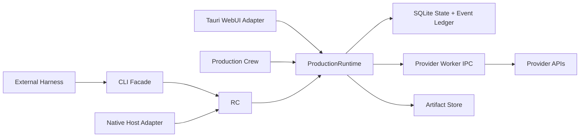

# Production Runtime V1 设计与剩余迁移

## 状态

本文件定义 Production Runtime 的目标接口、状态机、删除门槛与剩余迁移顺序；不再保存逐文件施工历史。命令实际可用性必须以 `command.list` 为准，不得从阶段文字推断。Agent 调度边界由 ADR 0061、0062 与 Agent 设计包定义，本文只负责 Runtime Authority、Task、Artifact 与 Provider Worker。

当前已形成安全本地 Control Plane、持久 Task/Event、Artifact、首批 Provider Route、Production Dry Run 与 Workflow Projection 基线；尚未完成的重点是删除所有 legacy-only 执行轨、扩大 Provider-neutral Capability 覆盖、完成 Draft Authority 切换，以及发行态恢复/打包验收。

- [ADR 0002：制作执行保持本地优先](../adr/0002-local-first-production-execution.md)
- [ADR 0010：Artifact 使用稳定 ID 与内容寻址](../adr/0010-use-content-addressed-local-artifacts.md)
- [ADR 0023：统一制作执行、授权与状态契约](../adr/0023-centralize-production-execution-contract.md)
- [ADR 0025：统一 Production Skill 契约与包边界](../adr/0025-standardize-production-skill-packages.md)
- [ADR 0027：使用 Schema 驱动的统一 Route Mapping](../adr/0027-use-schema-driven-route-mapping.md)
- [ADR 0061：使用外部导演台与内置制作组](../adr/0061-use-external-director-and-internal-production-crew.md)
- [ADR 0058：以 AI 原生 Workflow Draft 驱动画布](../adr/0058-use-ai-native-workflow-draft.md)
- [Agent 架构设计包](../design/agent/README.md)
- [Production Runtime 数据契约](production-runtime-data-contract.md)
- [领域词汇](../maintenance/agent/CONTEXT.md)

## V1 目标

让 External Coding Agent Harness 经 Operation Skill + CLI 把有界意图交给 Flovart Production Crew，并立即拿到持久任务句柄；WebUI 关闭、CLI 断开或 Desktop Runtime 重启后仍可查询、观察、取消或恢复，Provider 凭据始终不离开 Desktop Runtime 与受控 Provider Worker。

首个可放行垂直切片定义为：

1. CLI 或 WebUI 提交一次图片生成意图。
2. Desktop Runtime 在返回前持久化 Command、Task、StageRun 和事件。
3. Runtime 使用 `credentialRef` 调用 Provider Worker，不向调用方返回 Secret。
4. Provider 结果被下载并写入 Artifact Store。
5. Runtime 以带 revision 的原子操作更新 Workflow Project。
6. 关闭 WebUI或重启 Desktop Runtime 后，任务和结果仍可查询。
7. CLI、WebUI 与 Production Crew 从同一 Runtime Module 得到一致状态。

图片切片通过后，再按同一接口增加视频、语音、音乐、渲染和验证；不先造一套无法证明恢复语义的全命令表。

## 非目标

- V1 不把 Production Authority 放到云端 Hub。
- Production Skill 不接触 Provider Secret、Provider HTTP endpoint 或任意 Shell。
- Desktop 或已配对 Web 项目不让 WebUI 继续承担长任务执行权威；纯 Web 模式仍明确受标签页生命周期与浏览器密钥边界限制。
- 不为尚未存在的远程 Runtime、集群调度或跨设备同步预留复杂抽象。
- 不向 Coding Agent 暴露 MCP Server，也不让外部 Harness 的模型工具直接依赖 Runtime 私有协议；DeepSeek Embedded Client 只按 ADR 0062 通过 Harness Host 的受限同源代理调用 Workflow 命令子集，Workspace Token 不进入浏览器。
- 本轮规划不恢复或重写 Canvas、Table、Workflow 的视觉界面。

## 剩余缺口

1. `command.list` 仍包含 legacy-only 命令和旧安装文案；可写路径尚未全部切到同一 ProductionRuntime/Workspace Authority。
2. 浏览器 Provider 执行、旧 Agent Route 与 Runtime Capability 仍有重叠，尚未形成单一 Production Authority。
3. Workflow Draft 仍以浏览器本地权威为主，Desktop Authority Transfer、revision CAS 与 Runtime 重启后的完整恢复需要实机闭环。
4. ProviderAttempt、Submission Unknown、远端取消、实际账单和 Artifact 恢复语义只在部分 Route 落地。
5. ProductionRun 的 speech、music、render、verify 与发布 Gate 尚未形成完整可发行短片链路。
6. Runtime Release Bundle、固定 Crew Node Runtime、升级回滚和跨平台安装仍需发行态验证。

## 深 Module 与 seam

### 外部 Module

建立一个 `ProductionRuntime` Module。它的 Interface 只有五类操作：

```text
submit(commandEnvelope)        -> CommandResult | TaskReceipt
getTask(taskId)                -> RuntimeTask
listTasks(filter, cursor)      -> RuntimeTaskPage
cancelTask(taskId, reason)     -> RuntimeTask
streamEvents(afterEventId)     -> RuntimeEventStream
```

所有命令种类都是 `commandEnvelope.command` 的封闭联合，不为每个命令再创建一层浅转发 Module。调用方和测试都只跨越这个 seam。



### Adapter

| Adapter | 用途 | 约束 |
| --- | --- | --- |
| Tauri WebUI Adapter | 主窗口调用 Runtime | 使用 Tauri capability/permission，只传类型化命令 |
| Local HTTP Adapter | CLI、TUI 与 Production Crew 内部客户端 | 随机 loopback 端口、启动期 Bearer Token、协议握手；不是外部 Harness 的公开接口 |
| Native Host Adapter | Chrome/Edge 扩展 | 从 Runtime Discovery Record 发现端口，不读取 Secret |
| In-Memory Adapter | Runtime 集成测试 | 与生产 Adapter 使用同一 Interface，不测试内部实现 |
| Provider Worker Adapter | Runtime 调用现有 TypeScript Provider 能力 | 私有 JSONL stdio，只在请求执行时注入所需 Secret |

## 命令契约

### CommandEnvelope

```json
{
  "protocolVersion": "1",
  "commandId": "cmd_...",
  "command": "generate.image",
  "args": {},
  "source": "cli",
  "idempotencyKey": "user-or-agent-stable-key",
  "expectedRevision": 12,
  "productionSessionId": "ps_..."
}
```

规则：

- 所有写操作必须有 `idempotencyKey`。
- 同一 source 与 idempotency key 重试时返回原 receipt；payload 不同则返回冲突。
- 图变更必须带 `expectedRevision`，过期时返回当前 revision，不做静默覆盖。
- `args` 必须由 registry 中的封闭 JSON Schema 校验；禁止通用任意 `patch` 进入 Provider 或图核心字段。
- Secret 只能通过 `credentialRef` 在 Runtime 内解析。

### 返回值

同步原子命令：

```json
{
  "kind": "result",
  "commandId": "cmd_...",
  "eventId": 101,
  "data": {}
}
```

长任务：

```json
{
  "kind": "task",
  "commandId": "cmd_...",
  "taskId": "task_...",
  "status": "working",
  "pollIntervalMs": 1000,
  "eventId": 102
}
```

`TaskReceipt` 必须在 Provider 网络请求之前提交到 SQLite。

### 命令分层

| 层 | 示例 | 谁可以调用 |
| --- | --- | --- |
| Production Intent | `production.run`、`workflow.node.run`、`generate.image`、`generate.video` | External Harness（经 CLI）、Production Crew、WebUI |
| Atomic Runtime | `workflow.node.move`、`workflow.connect`、`artifact.import`、`capability.submit` | Flovart Skill、第一方 UI、受控 operator |
| Private Provider IPC | `provider.submit`、`provider.poll`、`provider.cancel` | 仅 Desktop Runtime |

推荐把公开原子生成 seam 定义为 Provider-neutral 的 `capability.submit`，输入为 Capability Requirement；Provider Job 是 Runtime 内部的 ProviderAttempt，不向社区 Production Skill 暴露 Provider endpoint。

## Runtime Task 生命周期

Runtime Task 使用以下封闭状态：

```text
queued -> working -> completed
                  -> input_required -> working
                  -> failed
                  -> cancelled
```

`submission_unknown` 不是 Task 终态，而是 ProviderAttempt 状态；对应 StageRun 进入 blocked，Task 进入 `input_required`，禁止自动重复提交可能已经计费的请求。

恢复规则：

- Worker 领取任务时写入 `lease_owner` 和 `lease_expires_at`。
- Worker 定期续租；Runtime 启动时扫描过期 lease。
- 纯本地且幂等的步骤可以重新入队。
- 已持久化 `external_job_id` 的 ProviderAttempt 恢复轮询。
- 网络提交结果不确定且没有 Provider 幂等保证时进入 `submission_unknown`。
- Cancel 是协作式请求；只有 Provider 确认取消后才显示 Provider Job 已取消，否则显示“已停止等待”。

## SQLite 状态模型

V1 直接建立新表，不把现有 `sync_log` 伪装成 ProductionRun 数据库。

| 表 | 责任 |
| --- | --- |
| `command_receipts` | CommandEnvelope、payload hash、idempotency key 与首次 receipt |
| `runtime_tasks` | Task 状态、结果、错误、lease、取消请求与保留期限 |
| `production_runs` | ProductionSpec Revision 的一次实际执行 |
| `stage_runs` | 能力阶段、依赖、阻塞、重试与输出 |
| `provider_attempts` | Route 快照、request hash、external job ID、提交/轮询生命周期 |
| `artifacts` | 内容哈希、媒体类型、尺寸、时长、存储位置 |
| `artifact_inputs` | Artifact 来源依赖和角色 |
| `production_spec_revisions` | 不可变 ProductionSpec Core、Extension、版本与内容哈希 |
| `workflow_projects` | Workflow 工作区身份、当前 ProductionSession 与唯一 Draft Authority Binding |
| `workflow_drafts` | 批准前的可编辑画布真相，保存节点、连线、Prompt、参考、参数、工具步骤与布局 |
| `workflow_draft_changesets` | 一个 Agent 回合或连续人工手势的语义历史、差异和撤销边界 |
| `workflow_draft_actions` | ChangeSet 内类型化、可重放、可逆的画布动作 |
| `workflow_plan_projections` | 从 Spec/Run 派生的可重建节点投影 |
| `workflow_layouts` | 已批准运行投影的节点位置、折叠、视口和独立 layout revision |
| `runtime_events` | 单调事件 ID、实体、事件类型和 payload |

完整列、唯一约束、路由/审批/预算/Agent 表与 JSON 契约见 [Production Runtime 数据契约](production-runtime-data-contract.md)。

关键事务：

1. 接受命令：receipt、task/run/stage 与首个事件同事务提交。
2. Provider 提交前：ProviderAttempt 与 Cost Reservation 先提交。
3. Provider 返回：Attempt 状态、Artifact、StageRun、Production Plan Projection 与事件同事务提交；不得覆盖未批准 Workflow Draft。
4. 每个查询读 State Projection；SSE 从 `runtime_events` 读取并支持 `Last-Event-ID`。

Runtime SQLite 结构应单独记录在 `docs/content/docs/runtime/runtime-storage.mdx`，不要混入 Go Enterprise Backend 数据库文档。

## 安全设计

1. 删除 HTTP `GET /state/keys/:provider/:keyId` 的 Secret 返回能力。
2. Runtime 绑定 `127.0.0.1:0` 随机端口，不再依赖固定 `7421`。
3. 启动时生成随机 Token，将 PID、端口、协议版本和 Token 写入当前用户受保护的 Runtime Discovery Record。
4. Local HTTP Adapter 除 `/status` 最小健康信息外全部要求 `Authorization: Bearer ...`。
5. WebUI 优先通过 Tauri command 调用同一 Runtime Module，并用 capability/permission 限制窗口与命令。
6. Keyring Interface 只提供 metadata、resolve-for-worker 和 delete；不向 HTTP、CLI、Production Crew 或 WebUI 返回 Secret。
7. Provider Worker stdout 只允许协议 JSON；日志写 stderr，并对 token、Authorization、URL query 和 data URL 脱敏。

## Canonical Registry

新增一个语言无关、版本化的 command registry，保存：

- command 名称与 stability；
- input/output JSON Schema；
- sync/task 执行模式；
- public/operator/internal exposure；
- mutating、requiresIdempotency、requiresRevision；
- 所需 Runtime Capability 与权限。

以下内容必须从同一 registry 生成或读取：

- `flovart command.list/schema`
- CLI 参数与 `--help`
- Flovart Skill 命令参考
- WebUI 与 Production Crew action schema
- Contract tests

不要再手工维护 CLI registry、Crew tool schema 和 Skill 命令表多份真相。

## 实施切片

状态只表示本地基线，不替代 `command.list`、自动测试与真实运行验收。

### S0：安全 Control Plane（基线已存在，继续收口）

范围：

- 建立 `ProductionRuntime` Interface 与 in-memory 测试实现。
- 增加随机端口、Discovery Record、Bearer 中间件和协议握手。
- WebUI Tauri Adapter 与 CLI `RuntimeClient` 都调用同一 Module。
- 删除 HTTP Secret 读取路由。

验收：

- 无 Token 的所有状态写入和命令提交返回 401。
- CLI、Production Crew、普通网页和本机无 Origin 请求均无法读取 Secret。
- WebUI 与 CLI 调用同一测试命令，得到相同 command/event ID。
- Desktop Runtime 未启动时，CLI 返回明确的 `RUNTIME_UNAVAILABLE` 和启动建议。

### S1：持久图片生成 tracer bullet（基线已存在，继续统一权威）

范围：

- 建立 runtime task、event、provider attempt、artifact 与 workflow project 表。
- `generate.image` 成为 Production Intent Command，立即返回 `taskId`。
- 提取现有图片 Provider 调用为 Provider Worker Adapter。
- 结果落 Artifact Store，并以 expected revision 更新 Workflow。
- 增加 `task.get/list/watch/cancel/result`。

验收：

- 同一 idempotency key 重试不会产生第二次 ProviderAttempt。
- Provider Fake 可模拟成功、失败、超时、submission unknown 和取消。
- WebUI 关闭时任务继续；重新打开后从事件 ID 续传。
- Desktop Runtime 在 submitted/polling 阶段重启后继续查询同一 external job。
- 结果 Artifact、Workflow node 和 generation history 指向同一来源记录。

### S2：持久视频生成（部分 Route 已接入）

范围：

- 在不改变 Task Interface 的情况下增加视频 capability。
- 持久化 source Artifact role、duration、resolution、audio flag 与最终 Route 快照。
- 实现 Provider 有取消接口与无取消接口两种 Adapter 行为。

验收：

- 关闭 CLI、TUI 或 WebUI 不取消 Provider Job。
- `task.cancel` 不虚报 Provider 已取消。
- 视频下载、校验和 Artifact 物化可断点恢复或安全重试。
- `video.status` 被 `task.get` 取代或成为只读别名，不再形成第二套任务模型。

### S3：ProductionRun 编排（Dry Run 与 Projection 已有基线）

范围：

- 接受 ProductionSpec Revision，建立 ProductionRun 与 StageRun DAG。
- 支持预算、审批、并发上限、阶段重试和 Replan Request。
- 新增 `production.run/status/watch/approve/cancel/retry-stage`。

验收：

- Agent 可以在断线后只凭 ProductionRun ID 恢复上下文。
- 已完成 Artifact 不因重规划被重复生成。
- 所有费用预留与 ProviderAttempt 可追溯到 StageRun。
- Production Skill 只能声明 Capability Requirement，不能指定 Secret 或任意 endpoint。

### S4：完整短片能力（剩余主链）

范围：

- 增加 speech、music、render 和 verify capability。
- 把 VOX prototype 的缺失步骤映射为正式 Runtime Capability。
- 首个样例固定为约 3 个 beat、6 个 shot 的 15 秒 VOX ProductionSpec，使用 Balanced Review Policy。
- 产出最终 MP4、校验报告和 Artifact Provenance。

验收：

- VOX 测试 ProductionSpec 的所有阶段都能被 registry 解析。
- Dry Run 不调用 Provider，并输出费用、能力、模型和审批缺口。
- 经用户单独批准后再运行最小付费 Provider Smoke Test。
- 最终 MP4 具有预期视频/音频流、时长、分辨率和可播放性。

### S5：Production Crew 与 Agent 控制面接入（见 Agent 设计包）

- Workspace Operator 只提交受限 Intent，并获得 `TaskReceipt` 或 `Workspace Operator Receipt`。
- Agent Workspace 根据 Director Binding、Task/Event、审批和 Artifact 构建可重建投影，不保存主聊天镜像。
- 外部 Harness 始终经 CLI 查询、取消和恢复；接入不改变 ProductionRuntime、SQLite 或 Provider Worker 的权威边界。

## 文件落点

建议落点，不要求按文件数量机械拆分：

```text
src-tauri/src/runtime/
  mod.rs              ProductionRuntime Interface 与组合根
  command.rs          CommandEnvelope、receipt 和 registry validation
  store.rs            SQLite transaction 与 State Projection
  task.rs             lease、恢复、取消和状态机
  events.rs           Runtime Event Ledger 与订阅
  control_server.rs   authenticated loopback Adapter

runtime/contracts/
  commands.json       canonical command registry
  schemas/            versioned input/output JSON Schema

tools/flovart/
  runtime-client.js   CLI 与第一方本地客户端共用
  cli.js              参数/输出 Adapter
  provider-worker/    私有 JSONL worker
```

`services/workflowGeneration.ts` 中的纯 Prompt、引用与请求构建逻辑可以被提取复用；浏览器存储、UI 状态、预算、Provider 生命周期和节点提交不得整体搬进 Worker。

## 测试策略

测试只跨越 ProductionRuntime Interface，不在新 Runtime 测试上继续叠加旧 file bridge 测试。

| 层次 | 必测内容 |
| --- | --- |
| Contract | registry 对 CLI、WebUI 与 Production Crew schema 生成一致 |
| Runtime integration | command receipt、幂等冲突、事务、lease、重启、事件续传 |
| Provider fake | success、failed、timeout、cancel、submission unknown、重复 webhook/poll |
| Artifact | 内容哈希去重、原子写入、损坏检测、来源关系 |
| Workflow | revision CAS、节点目标不存在、重复结果、不覆盖并发编辑 |
| Security | 无 Token、错误 Token、过期 Discovery Record、Secret 脱敏 |
| Desktop E2E | WebUI 关闭/重开、Runtime 重启、CLI 继续观察同一 Task |

真实 Provider Smoke Test 必须单独请求费用批准，不能进入默认 CI。

## 替换与删除规则

项目尚未上线，不长期保留双轨兼容层。每个切片切换调用方并通过验收后，在同一实施阶段删除被替代路径：

- `.flovart/command-queue.json` file bridge；
- Tauri 内存 `BridgeQueue`；
- CLI `FILE_STATE_COMMANDS` / `BROWSER_COMMANDS` 双轨路由；
- Provider browser command 轮询；
- 只存在于文档中的 Canvas/Element 假命令；
- 被新 Interface 覆盖的旧单元测试。

保留 `export.project` 作为用户主动导出路径；是否导入现有浏览器项目数据，需要在实施前单独确认，不默认写旧数据迁移层。

## 当前收口顺序

1. **统一调用方**：把仍为 legacy-only 的 Provider/Workflow 写路径切到 Canonical Registry、Workspace Authority 与 ProductionRuntime。
2. **恢复语义**：补齐 ProviderAttempt、Submission Unknown、远端取消、账单和 Artifact 重启恢复。
3. **Draft Authority**：完成 Browser → Desktop 显式转移、revision CAS 与 ProductionSpec Revision 冻结。
4. **完整短片 Capability**：落地 speech、music、render、verify 与发布 Gate，并以最小 VOX ProductionSpec 验收。
5. **发行闭环**：验证 Runtime Release Bundle、固定 Node Runtime、升级回滚、Windows/macOS/Linux 安装和 CLI-only 降级。

每个切片都必须保持当前已验证命令可运行；切换完成后在同一批次删除旧轨，不发布双 Production Authority。

## 放行门

以下条件全部满足后，才能宣称 Production Runtime V1 完成：

1. Production Authority 只有一个。
2. Secret 无法通过 CLI、Production Crew、HTTP 或 WebUI 读回。
3. 所有写命令有持久 idempotency receipt。
4. Task 在 WebUI 关闭和 Runtime 重启后仍可恢复。
5. Runtime Event Stream 可以从已知事件 ID 续传。
6. ProviderAttempt 对 submission unknown 不自动重提。
7. Workflow 更新使用 revision CAS。
8. CLI、Production Crew、WebUI 和 Operation Skill 文档来自同一 registry。
9. 聚焦测试、Rust 测试、TypeScript 类型检查和 Desktop E2E 分别通过。
10. todo 完成项移动到 pending-test；用户确认后再进入正式功能文档。

## 已确认决策

1. 公开原子生成 seam 使用 Provider-neutral `capability.submit`；Provider Job 仅作为本地执行权威内部的 ProviderAttempt，见 [ADR 0023](../adr/0023-centralize-production-execution-contract.md) 与 [ADR 0027](../adr/0027-use-schema-driven-route-mapping.md)。
2. 首个 tracer bullet 使用图片任务，先验证持久化、幂等、恢复、Artifact 和 Workflow revision，再接视频。
3. 首个 WebUI Adapter 只接 Workflow；ProductionRuntime 保持 UI-neutral。Table 与 Agent 通过各自类型化 Interface 接入，不恢复旧 Canvas，也不混用三种工作区的图语义。
4. 批准前 Workflow Draft 是编辑权威，批准后 ProductionSpec Revision 是执行权威；Workflow 同时展示但明确分离 Draft 与可重建 Production Plan Projection。
5. 用户可以在已支持 Provider Adapter Family 内验证本地 BYOK Route，但未知协议必须新增受审 Adapter。
6. 每个 ProductionSession 在 V1 中至多绑定一个 Bound Production Skill；无绑定时直接使用 ProductionSpec Core。
7. Runtime/TUI 持续监控长任务，仅通过 Agent Intervention Event 唤醒 Coding Agent。
8. 完整产品验收固定包含 15 秒 VOX 端到端短片，并覆盖 WebUI/Harness 断线与 Runtime 重启恢复。
